# UML Mermaid - Rent Car Platform

> **Version:** 1.4 (Academic Friendly)
> **Last Updated:** 2026-05-17
> **Format:** Mermaid.js
> **Tujuan:** Diagram dibuat pendek per topik dan menggunakan bahasa proses bisnis agar mudah dipresentasikan untuk audiens akademis umum.

---

## Cara Membaca Dokumen Ini

Dokumen ini adalah versi Mermaid yang disiapkan untuk presentasi. Diagram besar dari versi sebelumnya dipecah menjadi beberapa bagian kecil supaya presenter tidak perlu menjelaskan terlalu banyak alur dalam satu gambar. Penamaan modul dan istilah pada diagram juga dibuat dalam bahasa proses bisnis agar dapat dipahami oleh pembaca yang tidak berlatar belakang teknis.

Urutan presentasi yang disarankan:

1. Mulai dari **Use Case** untuk menjelaskan siapa saja aktornya.
2. Lanjut ke **Class Diagram** untuk menunjukkan struktur data inti.
3. Gunakan **Sequence Diagram** per skenario untuk menjelaskan komunikasi sistem.
4. Tutup dengan **Activity Diagram Swimlane** untuk memperlihatkan proses lintas role.

---

## 1. Use Case Diagram

Use case dipecah menjadi empat kelompok: Customer, Pembayaran, Admin Operasional, dan Driver/Laporan. Ini lebih enak dipakai di slide karena tiap diagram punya satu fokus cerita.

### 1.1 Use Case Customer - Catalog, Rental, dan Shuttle

**Keterangan presentasi:**
Diagram ini menjelaskan journey customer dari login, melihat catalog, membuat order rental, atau memilih layanan shuttle. Customer loyal mendapat use case tambahan: memilih supir.

### 1.2 Use Case Pembayaran dan Kwitansi

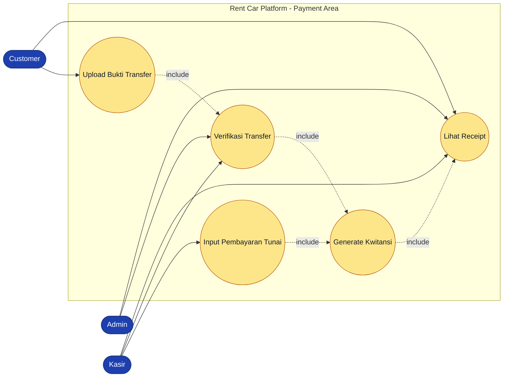

**Keterangan presentasi:**
Pembayaran dipisah karena ini adalah titik kontrol penting. Transfer harus diverifikasi, sedangkan cash diinput oleh kasir. Keduanya menghasilkan receipt setelah status payment menjadi paid.

### 1.3 Use Case Admin - Master Data dan Operasional Order

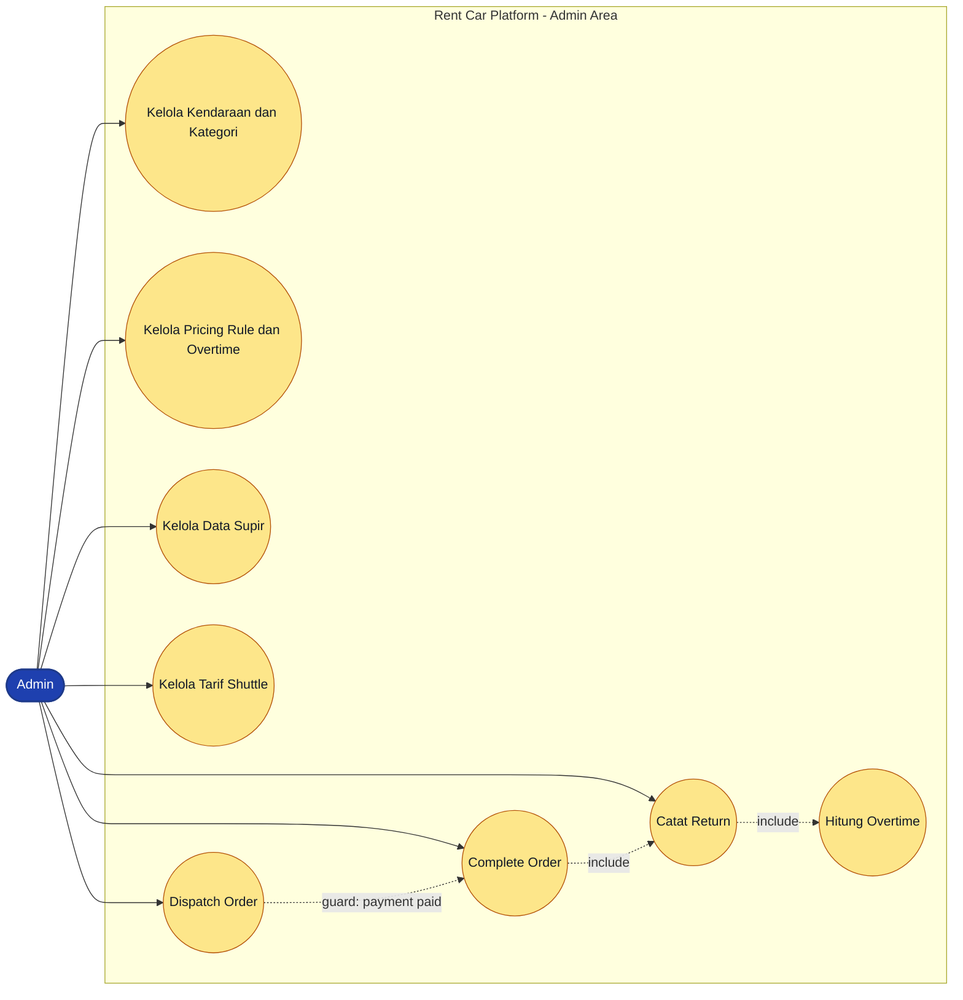

**Keterangan presentasi:**
Diagram ini menjelaskan peran admin sebagai pengendali operasional. Admin menyiapkan master data, menjalankan dispatch, mencatat return, dan menyelesaikan order.

### 1.4 Use Case Dashboard, Audit, dan Driver

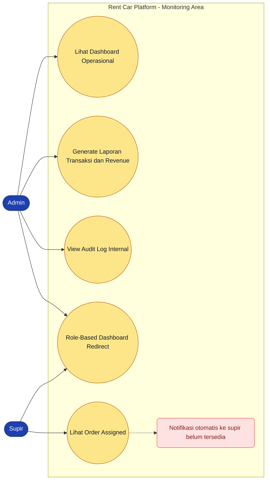

**Keterangan presentasi:**
Bagian ini cocok dipakai untuk menjelaskan dashboard, laporan, audit, dan batasan versi. Supir dapat melihat area kerjanya, tetapi notifikasi otomatis masih menjadi roadmap.

---

## 2. Class Diagram

Class diagram menggambarkan keseluruhan struktur data inti sistem mengikuti standar UML: **class** (nama, atribut bertipe data, metode), **multiplicities** (1, 0..1, 0..\*, 1..\*), serta tiga jenis hubungan (**association** untuk relasi biasa, **composition** untuk lifecycle terikat, **inheritance** untuk peran user). `OrderRental` dan `OrderShuttle` adalah dua jenis transaksi utama; `Pembayaran` bersifat polimorfik agar dapat dipakai untuk keduanya. `KategoriKendaraan` menjadi sumber `AturanHarga` dan `DendaKeterlambatan`. Visibility memakai konvensi `-` (private field), `+` (public method).

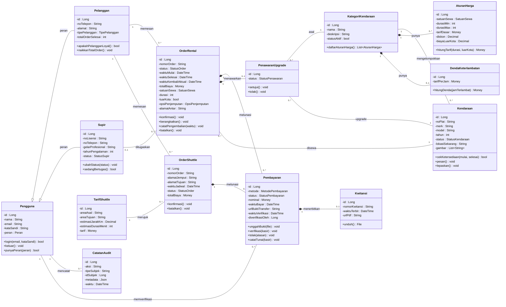

**Keterangan standar UML yang dipakai:**

- **Class 3-bagian:** nama (header), atribut bertipe data (`field : Tipe`), metode (`+nama() Tipe`).
- **Visibility:** `-` (private) untuk field karena diakses lewat method, `+` (public) untuk operasi yang dipanggil dari luar.
- **Inheritance** (`<|--`): `Pelanggan` dan `Supir` mewarisi `Pengguna` (peran user).
- **Composition** (`*--`): `Pembayaran` dan `Kwitansi`, `Order` dan `Pembayaran`, `KategoriKendaraan` dan aturan harganya — bagian tidak bisa hidup tanpa whole.
- **Association** (`--`): relasi biasa tanpa kepemilikan kuat (Pelanggan-Order, Kendaraan-Order, dst).
- **Multiplicities:** `1`, `0..1`, `0..*`, dengan label kata kerja (`memesan`, `melunasi`, `mengelompokkan`).

**Keterangan presentasi:**
`Pengguna` adalah akun yang dapat masuk ke sistem dan dipakai sebagai pelaku `CatatanAudit`. `Pelanggan` dan `Supir` adalah spesialisasi `Pengguna` (inheritance). `KategoriKendaraan` mengelompokkan kendaraan dan memiliki `AturanHarga` (tarif per satuan sewa) serta `DendaKeterlambatan` (tarif per jam terlambat) — keduanya komposisi karena mati bersama kategori. `OrderRental` menyimpan transaksi sewa kendaraan, `OrderShuttle` untuk layanan antar-jemput dengan tarif rute. Keduanya memiliki banyak `Pembayaran` secara polimorfik (komposisi karena hidup-mati bersama order). Setiap pembayaran lunas menerbitkan satu `Kwitansi` dan dicatat siapa kasir yang memverifikasi. `PenawaranUpgrade` menangani skenario kendaraan terpilih tidak tersedia sehingga sistem menawarkan kategori lebih tinggi.

---

## 3. Sequence Diagram

Sequence diagram dipecah per skenario supaya tiap slide hanya menjelaskan satu alur komunikasi. Nama partisipan menggunakan istilah modul fungsional, bukan nama kelas teknis, agar mudah diikuti audiens umum.

### 3.1 Sequence - Browse Catalog dan Login

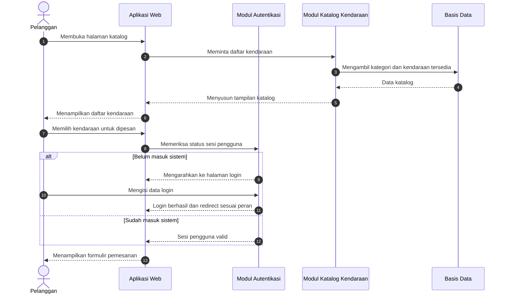

**Keterangan presentasi:**
Gunakan diagram ini untuk membuka cerita. Pelanggan tidak langsung membuat order; sistem memastikan data katalog tersedia dan pengguna sudah masuk.

### 3.2 Sequence - Membuat Order Rental

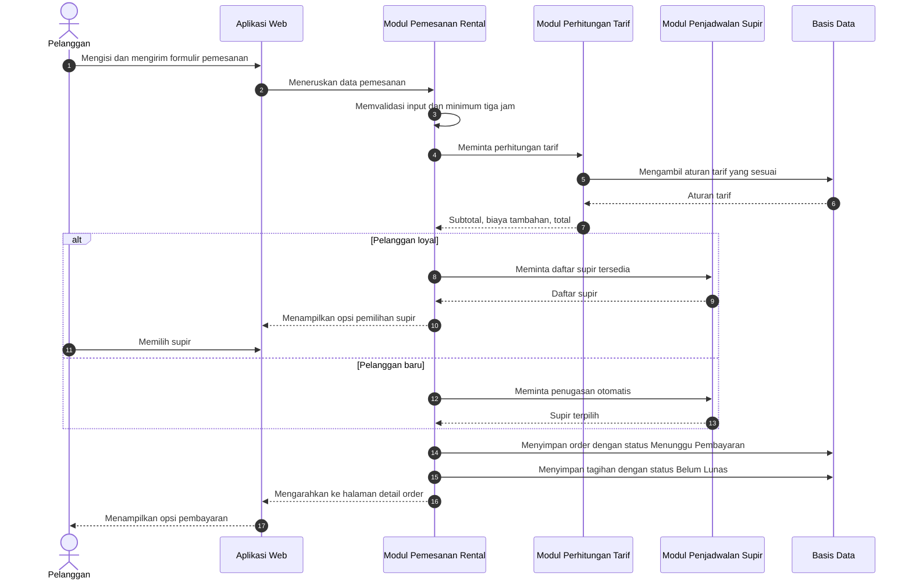

**Keterangan presentasi:**
Fokuskan pada aturan bisnis: minimum durasi tiga jam, perhitungan tarif otomatis, biaya tambahan luar kota, dan keistimewaan pelanggan loyal yang dapat memilih supir.

### 3.3 Sequence - Pembayaran Transfer

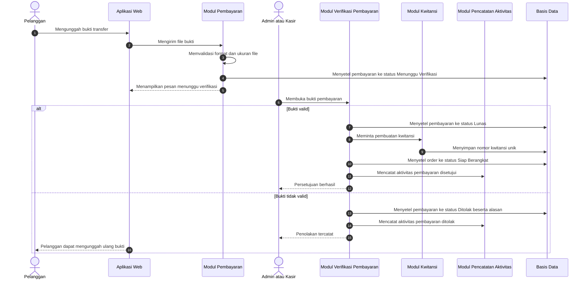

**Keterangan presentasi:**
Diagram ini menunjukkan kenapa status Menunggu Verifikasi diperlukan. Sistem tidak langsung menganggap transfer valid sebelum diperiksa oleh admin atau kasir.

### 3.4 Sequence - Pembayaran Tunai

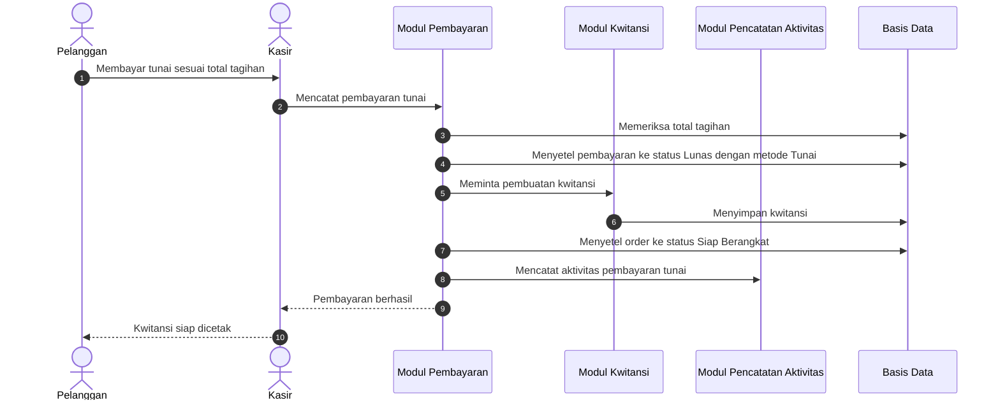

**Keterangan presentasi:**
Alur tunai lebih pendek dibanding transfer karena tidak perlu unggah dan verifikasi bukti. Namun tetap menghasilkan kwitansi dan catatan aktivitas.

### 3.5 Sequence - Dispatch Order

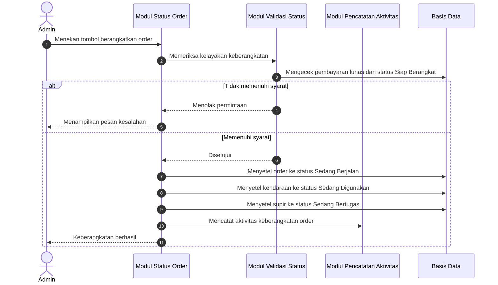

**Keterangan presentasi:**
Tekankan kunci pembayaran. Admin tidak dapat memberangkatkan order yang belum dibayar agar proses operasional tidak berjalan mendahului pembayaran.

### 3.6 Sequence - Pengembalian, Keterlambatan, dan Penyelesaian Order

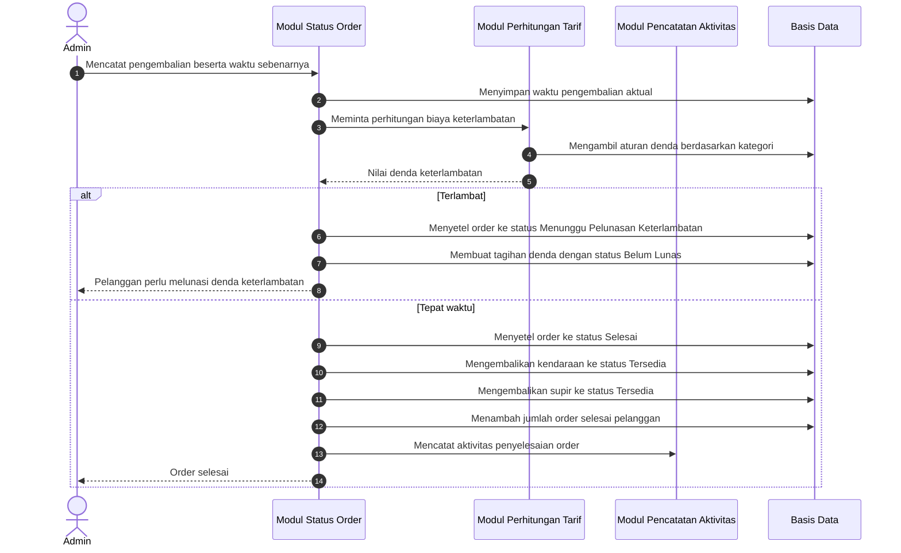

**Keterangan presentasi:**
Diagram ini menjelaskan akhir siklus rental. Jika terlambat, sistem membuat tagihan denda. Jika tepat waktu, order selesai dan sumber daya kendaraan serta supir dilepaskan kembali.

---

## 4. Activity Diagram Swimlane

Activity diagram dibuat seperti tabel/kolom agar mirip template swimlane pada gambar referensi. Setiap kolom menunjukkan siapa yang bertanggung jawab atas aktivitas tersebut.

### 4.1 Activity - Rental Booking sampai Order Dibuat

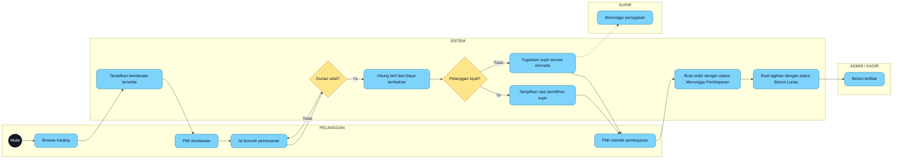

**Keterangan presentasi:**
Swimlane ini menunjukkan bahwa sampai order dibuat, tanggung jawab utama ada pada pelanggan dan sistem. Admin atau kasir baru terlibat setelah pelanggan memilih metode pembayaran.

### 4.2 Activity - Pembayaran Transfer

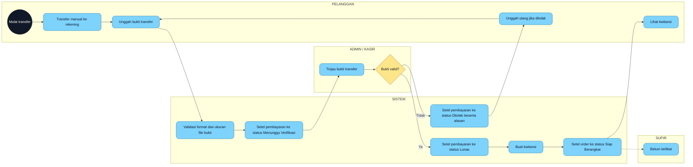

**Keterangan presentasi:**
Diagram ini cocok untuk menjelaskan persetujuan dan penolakan. Jika bukti salah, pelanggan tidak harus membuat order baru; cukup mengunggah ulang bukti pembayaran.

### 4.3 Activity - Pembayaran Tunai

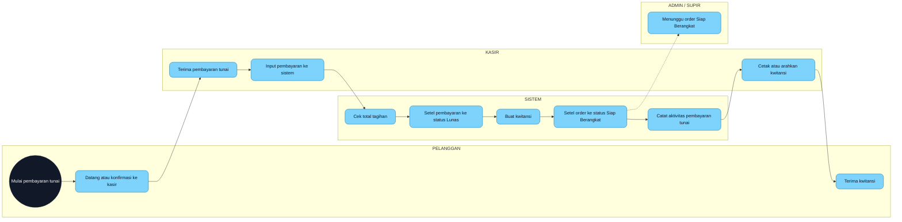

**Keterangan presentasi:**
Alur tunai lebih sederhana karena kasir langsung memvalidasi pembayaran. Namun sistem tetap memperbarui status dan menyimpan catatan aktivitas.

### 4.4 Activity - Dispatch, Trip, Pengembalian, dan Keterlambatan

```mermaid
flowchart LR
    classDef action fill:#7dd3fc,color:#0f172a,stroke:#0369a1,rx:12
    classDef decision fill:#fde68a,color:#111827,stroke:#b45309,rx:8
    classDef startend fill:#111827,color:#ffffff,stroke:#111827,rx:20

    subgraph PELANGGAN["PELANGGAN"]
        direction TB
        A1[Menunggu kendaraan atau layanan]:::action
        A2[Menggunakan kendaraan atau layanan]:::action
        A3[Membayar denda jika terlambat]:::action
        A4((Selesai)):::startend
    end

    subgraph SISTEM["SISTEM"]
        direction TB
        B1{Pembayaran lunas dan order siap berangkat?}:::decision
        B2[Setel order ke status Sedang Berjalan]:::action
        B3[Setel kendaraan Sedang Digunakan dan supir Sedang Bertugas]:::action
        B4[Hitung biaya keterlambatan]:::action
        B5{Terlambat?}:::decision
        B6[Buat tagihan denda keterlambatan]:::action
        B7[Setel order ke status Selesai]:::action
        B8[Lepaskan kendaraan dan supir]:::action
        B9[Tambah jumlah order selesai pelanggan]:::action
    end

    C0((Mulai dispatch)):::startend

    subgraph ADMIN["ADMIN"]
        direction TB
        C1[Tekan tombol berangkatkan order]:::action
        C2[Hubungi supir secara manual]:::action
        C3[Catat waktu pengembalian aktual]:::action
    end

    subgraph SUPIR["SUPIR"]
        direction TB
        D1[Menerima informasi order]:::action
        D2[Mengambil kendaraan]:::action
        D3[Menjalankan perjalanan]:::action
        D4[Mengembalikan kendaraan dan melapor ke admin]:::action
    end

    C0 --> C1
    C1 --> B1
    B1 -->|Tidak| C0
    B1 -->|Ya| B2 --> B3 --> C2 --> D1 --> D2 --> A1 --> A2 --> D3 --> D4 --> C3
    C3 --> B4 --> B5
    B5 -->|Ya| B6 --> A3 --> B7
    B5 -->|Tidak| B7
    B7 --> B8 --> B9 --> A4
```

**Keterangan presentasi:**
Diagram ini menunjukkan proses lintas peran paling lengkap. Admin memberangkatkan, sistem mengunci validasi pembayaran, supir menjalankan perjalanan, pelanggan menerima layanan, lalu admin mencatat pengembalian.

---

## 5. Catatan Presenter

Gunakan catatan ini agar penjelasan diagram tidak terlalu teknis:

- Untuk **use case**, jelaskan aktor dan tujuan, bukan detail kode.
- Untuk **class diagram**, fokus ke relasi utama: `Pelanggan -> OrderRental -> Pembayaran -> Kwitansi`.
- Untuk **sequence diagram**, pilih satu skenario saja per slide dan baca seperti kronologi peristiwa.
- Untuk **activity diagram**, ikuti kolom dari kiri ke kanan seperti proses bisnis lintas bagian.
- Saat ada gap seperti notifikasi supir atau peningkatan otomatis status pelanggan, sampaikan sebagai batasan versi dan rencana pengembangan, bukan kekurangan aplikasi.

---

## 6. Ringkasan Perubahan dari Versi Sebelumnya

- Use case besar dipecah menjadi 4 diagram pendek.
- Sequence end-to-end dipecah menjadi 6 sequence kecil.
- Activity diagram dibuat menjadi swimlane berbasis kolom peran.
- Penamaan partisipan pada sequence diagram diganti dari nama kelas teknis menjadi nama modul fungsional yang mudah dipahami audiens akademis umum.
- Atribut class diagram disederhanakan tanpa tipe data programming agar fokus pada makna data.
- Status order, kendaraan, dan pembayaran ditulis dalam bahasa Indonesia untuk konsistensi.
- Karakter encoding rusak dari versi lama dibersihkan.
