# UML Mermaid - Rent Car Platform

> **Version:** 1.3 (Presentation Ready)
> **Last Updated:** 2026-05-12
> **Format:** Mermaid.js
> **Tujuan:** Diagram dibuat pendek per topik agar lebih mudah dipresentasikan.

---

## Cara Membaca Dokumen Ini

Dokumen ini adalah versi Mermaid yang disiapkan untuk presentasi. Diagram besar dari versi sebelumnya dipecah menjadi beberapa bagian kecil supaya presenter tidak perlu menjelaskan terlalu banyak alur dalam satu gambar.

Urutan presentasi yang disarankan:

1. Mulai dari **Use Case** untuk menjelaskan siapa saja aktornya.
2. Lanjut ke **Class Diagram** untuk menunjukkan struktur data inti.
3. Gunakan **Sequence Diagram** per skenario untuk menjelaskan komunikasi sistem.
4. Tutup dengan **Activity Diagram Swimlane** untuk memperlihatkan proses lintas role.

---

## 1. Use Case Diagram

Use case dipecah menjadi empat kelompok: Customer, Pembayaran, Admin Operasional, dan Driver/Laporan. Ini lebih enak dipakai di slide karena tiap diagram punya satu fokus cerita.

### 1.1 Use Case Customer - Catalog, Rental, dan Shuttle

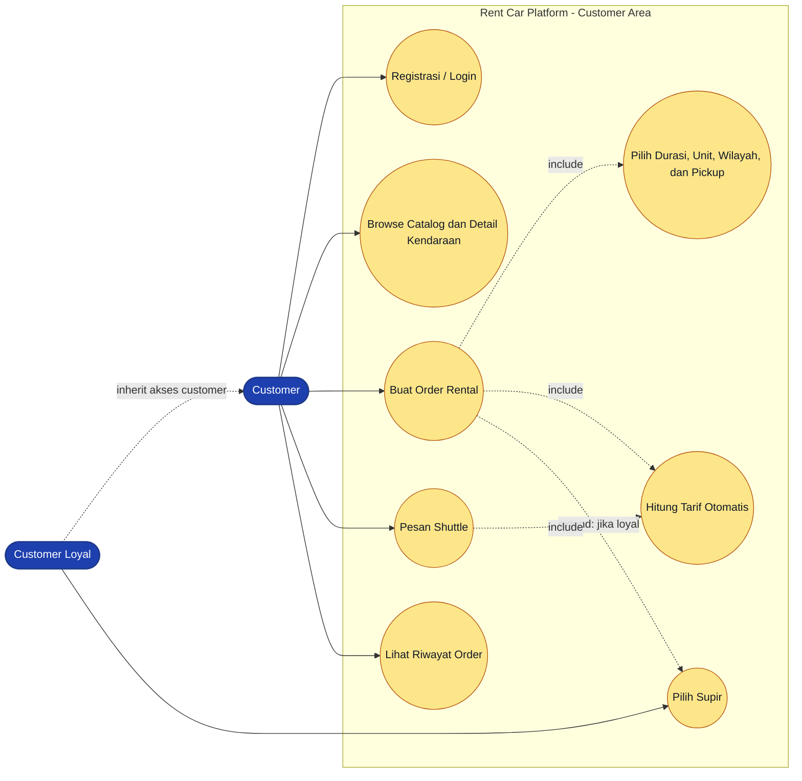

**Keterangan presentasi:**
Diagram ini menjelaskan journey customer dari login, melihat catalog, membuat order rental, atau memilih layanan shuttle. Customer loyal mendapat use case tambahan: memilih supir.

### 1.2 Use Case Pembayaran dan Kwitansi

**Keterangan presentasi:**
Pembayaran dipisah karena ini adalah titik kontrol penting. Transfer harus diverifikasi, sedangkan cash diinput oleh kasir. Keduanya menghasilkan receipt setelah status payment menjadi paid.

### 1.3 Use Case Admin - Master Data dan Operasional Order

**Keterangan presentasi:**
Diagram ini menjelaskan peran admin sebagai pengendali operasional. Admin menyiapkan master data, menjalankan dispatch, mencatat return, dan menyelesaikan order.

### 1.4 Use Case Dashboard, Audit, dan Driver

**Keterangan presentasi:**
Bagian ini cocok dipakai untuk menjelaskan dashboard, laporan, audit, dan batasan versi. Supir dapat melihat area kerjanya, tetapi notifikasi otomatis masih menjadi roadmap.

---

## 2. Class Diagram

Class diagram tetap disatukan karena struktur data inti masih bisa dibaca dalam satu gambar. `RentalOrder` menjadi pusat transaksi rental, sedangkan `Payment` dibuat polymorphic agar bisa dipakai untuk jenis order lain seperti shuttle.

**Keterangan presentasi:**
Jelaskan dari kiri ke kanan. `User` adalah akun login. `Customer` dan `Driver` adalah profil sesuai role. `VehicleCategory` mengelompokkan kendaraan. `RentalOrder` menyimpan transaksi rental. `Payment` dan `Receipt` menangani pembayaran dan bukti transaksi.

---

## 3. Sequence Diagram

Sequence diagram dipecah per skenario supaya tiap slide hanya menjelaskan satu alur komunikasi.

### 3.1 Sequence - Browse Catalog dan Login

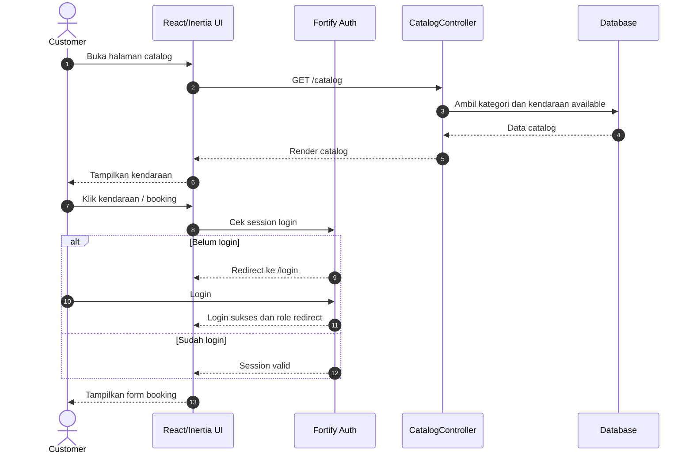

**Keterangan presentasi:**
Gunakan diagram ini untuk membuka cerita. Customer tidak langsung membuat order; sistem memastikan data catalog tersedia dan user sudah login.

### 3.2 Sequence - Create Rental Order

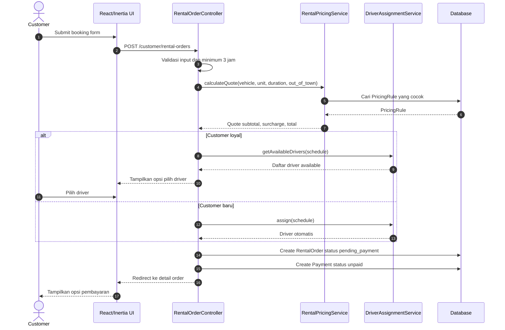

**Keterangan presentasi:**
Fokuskan pada business rules: minimum tiga jam, pricing rule, surcharge luar kota, dan customer loyal yang bisa memilih driver.

### 3.3 Sequence - Pembayaran Transfer

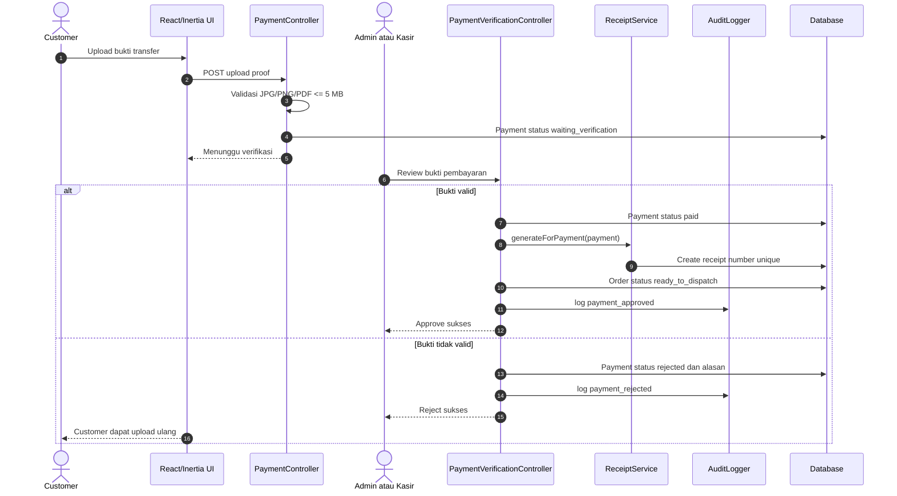

**Keterangan presentasi:**
Diagram ini menunjukkan kenapa status `waiting_verification` diperlukan. Sistem tidak langsung menganggap transfer valid sebelum dicek admin atau kasir.

### 3.4 Sequence - Pembayaran Tunai

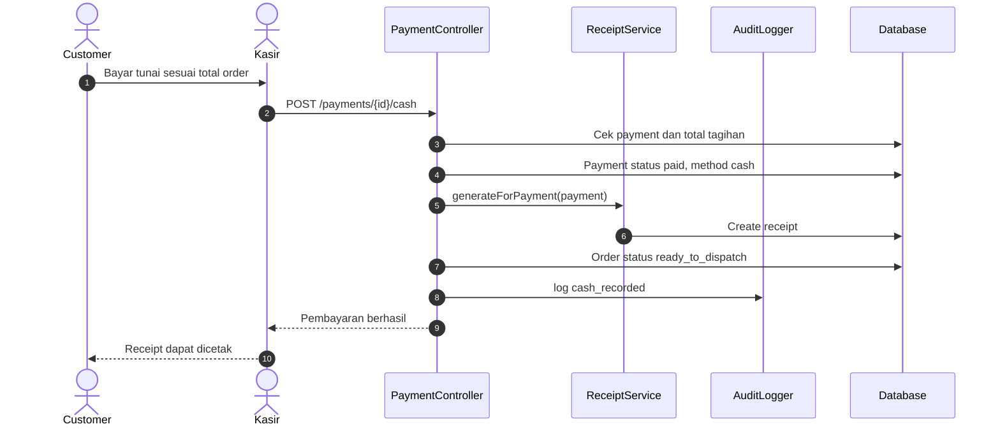

**Keterangan presentasi:**
Cash flow lebih pendek daripada transfer karena tidak perlu upload dan verifikasi bukti. Namun tetap menghasilkan receipt dan audit log.

### 3.5 Sequence - Dispatch Order

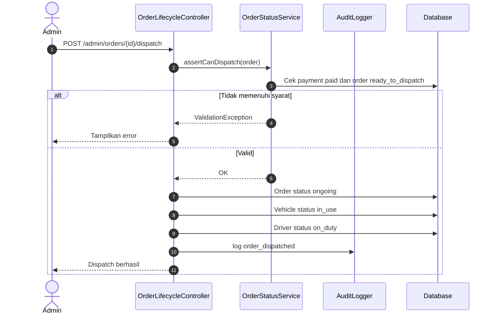

**Keterangan presentasi:**
Tekankan payment lock. Admin tidak bisa dispatch order yang belum dibayar agar proses operasional tidak berjalan mendahului pembayaran.

### 3.6 Sequence - Return, Overtime, dan Complete Order

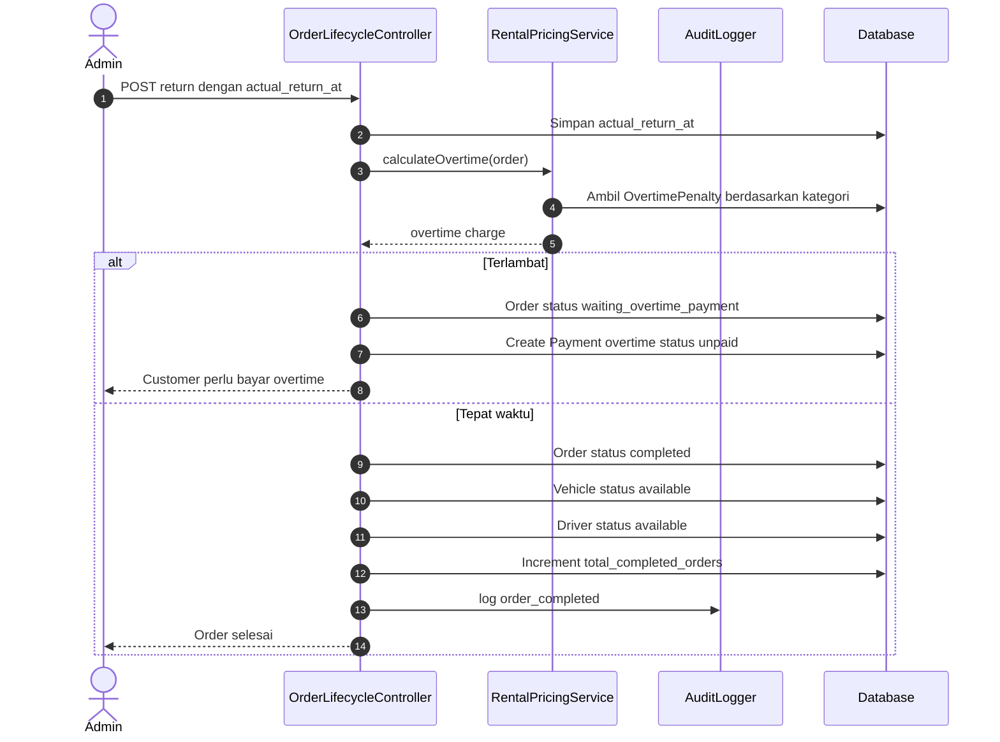

**Keterangan presentasi:**
Diagram ini menjelaskan akhir siklus rental. Jika terlambat, sistem membuat tagihan overtime. Jika tepat waktu, order selesai dan resource dilepas.

---

## 4. Activity Diagram Swimlane

Activity diagram dibuat seperti tabel/kolom agar mirip template swimlane pada gambar referensi. Setiap kolom menunjukkan siapa yang bertanggung jawab atas aktivitas tersebut.

### 4.1 Activity - Rental Booking sampai Order Dibuat

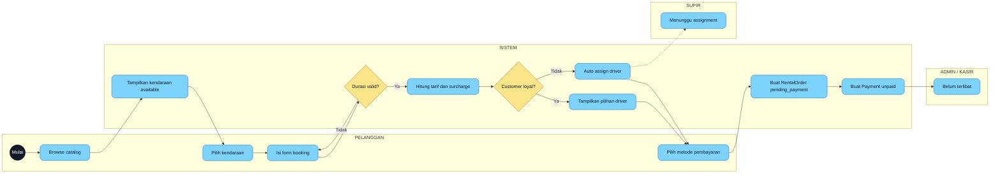

**Keterangan presentasi:**
Swimlane ini menunjukkan bahwa sampai order dibuat, tanggung jawab utama ada pada pelanggan dan sistem. Admin/kasir baru masuk setelah pembayaran dipilih.

### 4.2 Activity - Pembayaran Transfer

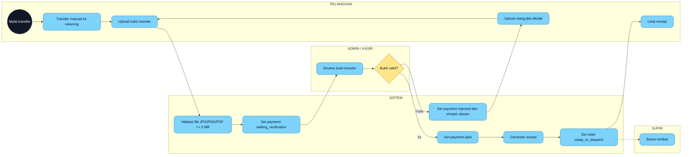

**Keterangan presentasi:**
Diagram ini cocok untuk menjelaskan approve/reject. Jika bukti salah, customer tidak harus membuat order baru; cukup upload ulang bukti.

### 4.3 Activity - Pembayaran Tunai

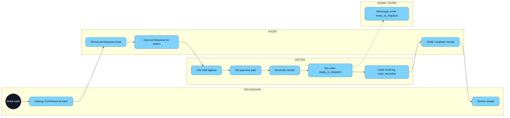

**Keterangan presentasi:**
Flow cash lebih sederhana karena kasir langsung memvalidasi pembayaran. Namun sistem tetap mengubah status dan membuat audit log.

### 4.4 Activity - Dispatch, Trip, Return, dan Overtime

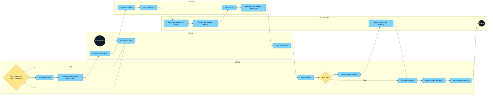

**Keterangan presentasi:**
Diagram ini menunjukkan proses lintas role paling lengkap. Admin dispatch, sistem mengunci validasi pembayaran, supir menjalankan trip, pelanggan menerima layanan, lalu admin mencatat return.

---

## 5. Catatan Presenter

Gunakan catatan ini agar penjelasan diagram tidak terlalu teknis:

- Untuk **use case**, jelaskan aktor dan tujuan, bukan detail kode.
- Untuk **class diagram**, fokus ke relasi utama: `Customer -> RentalOrder -> Payment -> Receipt`.
- Untuk **sequence diagram**, pilih satu skenario saja per slide.
- Untuk **activity diagram**, ikuti kolom dari kiri ke kanan seperti proses bisnis lintas bagian.
- Saat ada gap seperti notifikasi supir atau auto upgrade, sampaikan sebagai batasan versi dan roadmap, bukan error aplikasi.

---

## 6. Ringkasan Perubahan dari Versi Sebelumnya

- Use case besar dipecah menjadi 4 diagram pendek.
- Sequence end-to-end dipecah menjadi 6 sequence kecil.
- Activity diagram dibuat menjadi swimlane berbasis kolom role.
- Teks keterangan diperjelas untuk kebutuhan presentasi mahasiswa.
- Karakter encoding rusak dari versi lama dibersihkan.
