# 🧩 UML Mermaid — Rent Car Platform (Full Documentation)

> **Version:** 1.1 (As-built + Study Case aligned)
> **Last Updated:** 2026-05-09
> **Format:** Mermaid.js (renderable di GitHub/GitLab/VS Code/Notion)
> **Source:** `docs/STUDY_CASE.md` + actual implementation

---

## 📑 Table of Contents

1. [Use Case Diagram](#1-use-case-diagram)
2. [Class Diagram](#2-class-diagram)
3. [Entity Relationship Diagram (ERD)](#3-entity-relationship-diagram-erd)
4. [State Diagram — Order Lifecycle](#4-state-diagram--order-lifecycle)
5. [State Diagram — Payment Status](#5-state-diagram--payment-status)
6. [Activity Diagram — Booking Flow End-to-End](#6-activity-diagram--booking-flow-end-to-end)
7. [Activity Diagram — Payment Flow](#7-activity-diagram--payment-flow)
8. [Activity Diagram — Dispatch & Return](#8-activity-diagram--dispatch--return)
9. [Sequence Diagram — Customer Booking](#9-sequence-diagram--customer-booking)
10. [Sequence Diagram — Transfer Verification](#10-sequence-diagram--transfer-verification)
11. [Sequence Diagram — Free Upgrade Flow](#11-sequence-diagram--free-upgrade-flow)
12. [Component Architecture](#12-component-architecture)
13. [Deployment Diagram](#13-deployment-diagram)

---

## 1. Use Case Diagram

Mapping aktor ke use case sesuai Study Case §3 + §4.

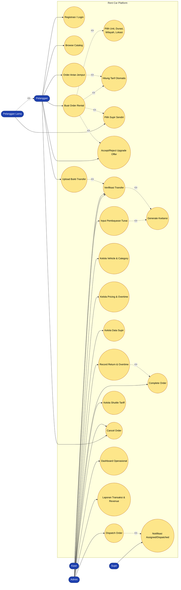

---

## 2. Class Diagram

Struktur domain (composition + Spatie roles pattern).

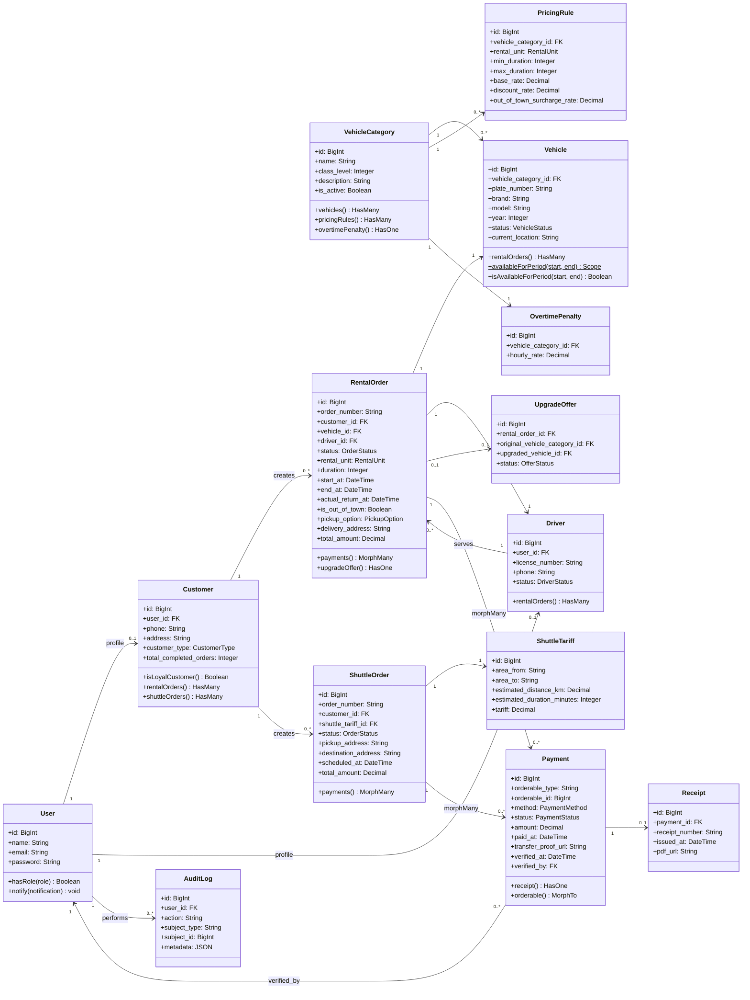

---

## 3. Entity Relationship Diagram (ERD)

Skema database dengan cardinality lengkap.

```mermaid
erDiagram
    USERS ||--o| CUSTOMERS : has_profile
    USERS ||--o| DRIVERS : has_profile
    USERS ||--o{ AUDIT_LOGS : performs
    USERS ||--o{ MODEL_HAS_ROLES : assigned

    CUSTOMERS ||--o{ RENTAL_ORDERS : books
    CUSTOMERS ||--o{ SHUTTLE_ORDERS : books

    VEHICLE_CATEGORIES ||--o{ VEHICLES : classifies
    VEHICLE_CATEGORIES ||--o{ PRICING_RULES : prices
    VEHICLE_CATEGORIES ||--|| OVERTIME_PENALTIES : late_fee

    VEHICLES ||--o{ RENTAL_ORDERS : used_in

    DRIVERS ||--o{ RENTAL_ORDERS : assigned_to

    RENTAL_ORDERS ||--o| UPGRADE_OFFERS : may_have
    RENTAL_ORDERS ||--o{ PAYMENTS : paid_by
    SHUTTLE_ORDERS ||--o{ PAYMENTS : paid_by
    SHUTTLE_TARIFFS ||--o{ SHUTTLE_ORDERS : tariff_for

    PAYMENTS ||--o| RECEIPTS : issues
    PAYMENTS }o--|| USERS : verified_by

    USERS {
        bigint id PK
        string name
        string email UK
        string password
        timestamp email_verified_at
        timestamps
    }

    CUSTOMERS {
        bigint id PK
        bigint user_id FK
        string phone
        string address
        enum customer_type "new|loyal|corporate"
        int total_completed_orders
    }

    DRIVERS {
        bigint id PK
        bigint user_id FK
        string license_number
        string phone
        enum status "available|reserved|on_duty|off_duty|inactive"
    }

    VEHICLE_CATEGORIES {
        bigint id PK
        string name
        int class_level
        text description
        bool is_active
    }

    VEHICLES {
        bigint id PK
        bigint vehicle_category_id FK
        string plate_number UK
        string brand
        string model
        int year
        enum status "available|reserved|in_use|maintenance|inactive"
        string current_location
    }

    PRICING_RULES {
        bigint id PK
        bigint vehicle_category_id FK
        enum rental_unit "hour|day|week|month"
        int min_duration
        int max_duration
        decimal base_rate
        decimal discount_rate
        decimal out_of_town_surcharge_rate "default 0.20"
    }

    OVERTIME_PENALTIES {
        bigint id PK
        bigint vehicle_category_id FK
        decimal hourly_rate
    }

    SHUTTLE_TARIFFS {
        bigint id PK
        string area_from
        string area_to
        decimal estimated_distance_km
        int estimated_duration_minutes
        decimal tariff
    }

    RENTAL_ORDERS {
        bigint id PK
        string order_number UK
        bigint customer_id FK
        bigint vehicle_id FK
        bigint driver_id FK
        enum status "draft|pending_payment|waiting_verification|paid|ready_to_dispatch|ongoing|waiting_overtime_payment|completed|cancelled"
        enum rental_unit
        int duration
        datetime start_at
        datetime end_at
        datetime actual_return_at
        bool is_out_of_town
        enum pickup_option
        string delivery_address
        decimal total_amount
    }

    SHUTTLE_ORDERS {
        bigint id PK
        string order_number UK
        bigint customer_id FK
        bigint shuttle_tariff_id FK
        enum status
        string pickup_address
        string destination_address
        datetime scheduled_at
        decimal total_amount
    }

    UPGRADE_OFFERS {
        bigint id PK
        bigint rental_order_id FK
        bigint original_vehicle_category_id FK
        bigint upgraded_vehicle_id FK
        enum status "pending|accepted|rejected"
    }

    PAYMENTS {
        bigint id PK
        string orderable_type "polymorphic"
        bigint orderable_id
        enum method "cash|bank_transfer"
        enum status "unpaid|waiting_verification|paid|rejected|refunded"
        decimal amount
        datetime paid_at
        string transfer_proof_url
        datetime verified_at
        bigint verified_by FK
    }

    RECEIPTS {
        bigint id PK
        bigint payment_id FK
        string receipt_number UK
        datetime issued_at
        string pdf_url
    }

    AUDIT_LOGS {
        bigint id PK
        bigint user_id FK
        string action
        string subject_type
        bigint subject_id
        json metadata
        datetime created_at
    }

    MODEL_HAS_ROLES {
        string model_type
        bigint model_id
        bigint role_id FK
    }
```

---

## 4. State Diagram — Order Lifecycle

State machine untuk RentalOrder status transitions.

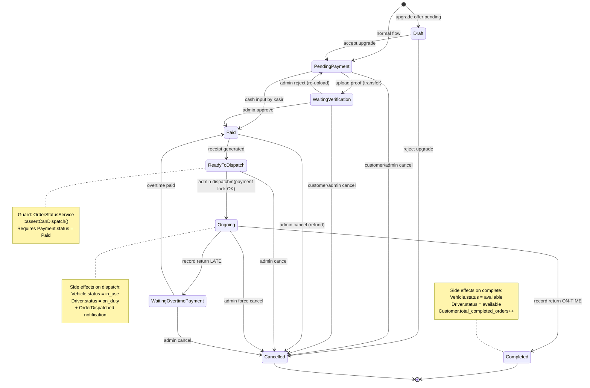

---

## 5. State Diagram — Payment Status

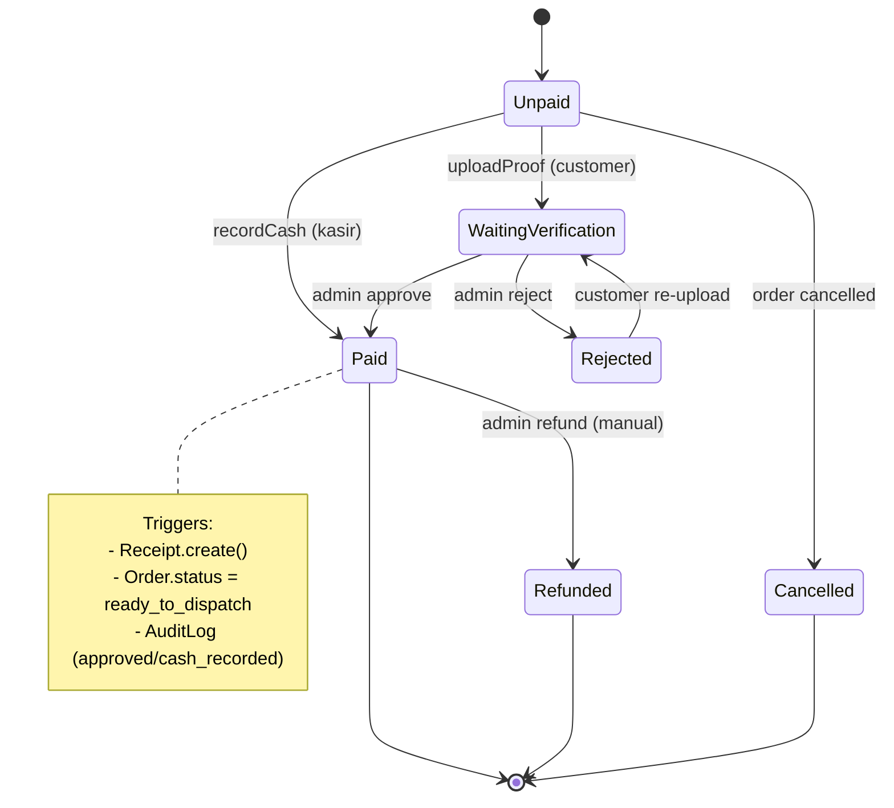

---

## 6. Activity Diagram — Booking Flow End-to-End

Covers Study Case §4 "Pemesanan" flow.

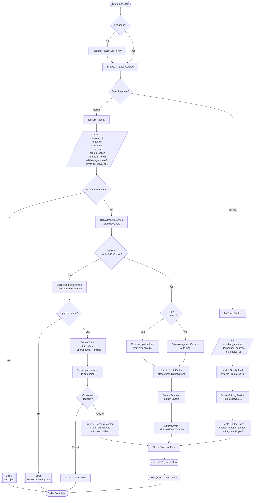

---

## 7. Activity Diagram — Payment Flow

Covers Study Case §2 "Smart Invoicing" requirements.

```mermaid
flowchart TD
    Start([Payment Created<br/>status=Unpaid]) --> Method{Method?}

    Method -->|Cash| CashFlow[Customer pays cash<br/>at kasir/admin]
    Method -->|Transfer| TransferFlow[Customer transfers<br/>to bank account]

    CashFlow --> RecordCash[POST /payments/{id}/cash<br/>by kasir/admin]
    RecordCash --> CashAuth{Role =<br/>kasir/admin?}
    CashAuth -->|No| Reject403[[403 Forbidden]]
    CashAuth -->|Yes| CashDB[/"Update Payment:<br/>status=Paid<br/>method=cash<br/>paid_at=now()"/]
    CashDB --> GenReceiptCash[ReceiptService<br/>::generateForPayment]
    GenReceiptCash --> OrderReadyCash[Order.status<br/>=ReadyToDispatch]
    OrderReadyCash --> AuditCash[AuditLog:<br/>cash_recorded]
    AuditCash --> Done([Ready for Dispatch])

    TransferFlow --> UploadProof[Customer uploads<br/>JPG/PNG/PDF ≤ 5MB]
    UploadProof --> ValidateFile{File valid?}
    ValidateFile -->|No| RejectFile[[Validation error]]
    ValidateFile -->|Yes| ProofDB[/"Update Payment:<br/>status=WaitingVerification<br/>transfer_proof_url=..."/]
    ProofDB --> AdminReview[Admin reviews<br/>at /admin/payments/verification]

    AdminReview --> AdminDecision{Approve or<br/>Reject?}

    AdminDecision -->|Approve| ApproveDB[/"Update Payment:<br/>status=Paid<br/>verified_by=user<br/>verified_at=now()"/]
    ApproveDB --> GenReceiptT[ReceiptService<br/>::generateForPayment]
    GenReceiptT --> OrderReadyT[Order.status<br/>=ReadyToDispatch]
    OrderReadyT --> AuditApprove[AuditLog:<br/>payment_approved]
    AuditApprove --> Done

    AdminDecision -->|Reject| RejectDB[/"Update Payment:<br/>status=Rejected<br/>rejected_reason=..."/]
    RejectDB --> AuditReject[AuditLog:<br/>payment_rejected]
    AuditReject --> ReUpload[Customer can<br/>re-upload proof]
    ReUpload --> UploadProof

    Reject403 --> EndErr([End])
    RejectFile --> EndErr
```

---

## 8. Activity Diagram — Dispatch & Return

Covers Study Case §4 "Pengiriman" and "Pengembalian".

```mermaid
flowchart TD
    Start([Admin clicks<br/>Dispatch button]) --> GuardCheck[OrderStatusService<br/>::assertCanDispatch]

    GuardCheck --> GuardPass{Paid AND<br/>ReadyToDispatch?}
    GuardPass -->|No| GuardFail[[ValidationException:<br/>Cannot dispatch]]
    GuardPass -->|Yes| DispatchTx[DB::transaction]

    DispatchTx --> UpdateOrder[Order.status<br/>=Ongoing]
    UpdateOrder --> UpdateVehicle[Vehicle.status<br/>=in_use]
    UpdateVehicle --> UpdateDriver[Driver.status<br/>=on_duty]
    UpdateDriver --> NotifyDispatch[Notify Driver:<br/>OrderDispatched]
    NotifyDispatch --> AuditDispatch[AuditLog:<br/>order_dispatched]
    AuditDispatch --> TripRunning[Driver menjalankan trip]

    TripRunning --> RecordReturn[Admin POST<br/>record return<br/>with actual_return_at]
    RecordReturn --> StoreReturn[Order.actual_return_at<br/>= input]
    StoreReturn --> CalcOvertime[RentalPricingService<br/>::calculateOvertime]

    CalcOvertime --> IsLate{actual ><br/>end_at?}

    IsLate -->|Yes| OvertimeCalc[/"hours = ceil((actual-end)/60)<br/>charge = hours × hourly_rate"/]
    OvertimeCalc --> OvertimeOrder[Order.status<br/>=WaitingOvertimePayment<br/>+ create Payment unpaid]
    OvertimeOrder --> OvertimePay[Customer bayar overtime<br/>→ kembali ke Payment Flow]
    OvertimePay --> CompleteFlow

    IsLate -->|No| CompleteFlow[completeOrder]

    CompleteFlow --> CompleteTx[DB::transaction]
    CompleteTx --> FinishOrder[Order.status<br/>=Completed]
    FinishOrder --> FreeVehicle[Vehicle.status<br/>=available]
    FreeVehicle --> FreeDriver[Driver.status<br/>=available]
    FreeDriver --> IncCustomer[Customer<br/>.total_completed_orders++]
    IncCustomer --> AuditComplete[AuditLog:<br/>order_completed]
    AuditComplete --> Done([Transaction Closed])

    GuardFail --> EndErr([Error])
```

---

## 9. Sequence Diagram — Customer Booking

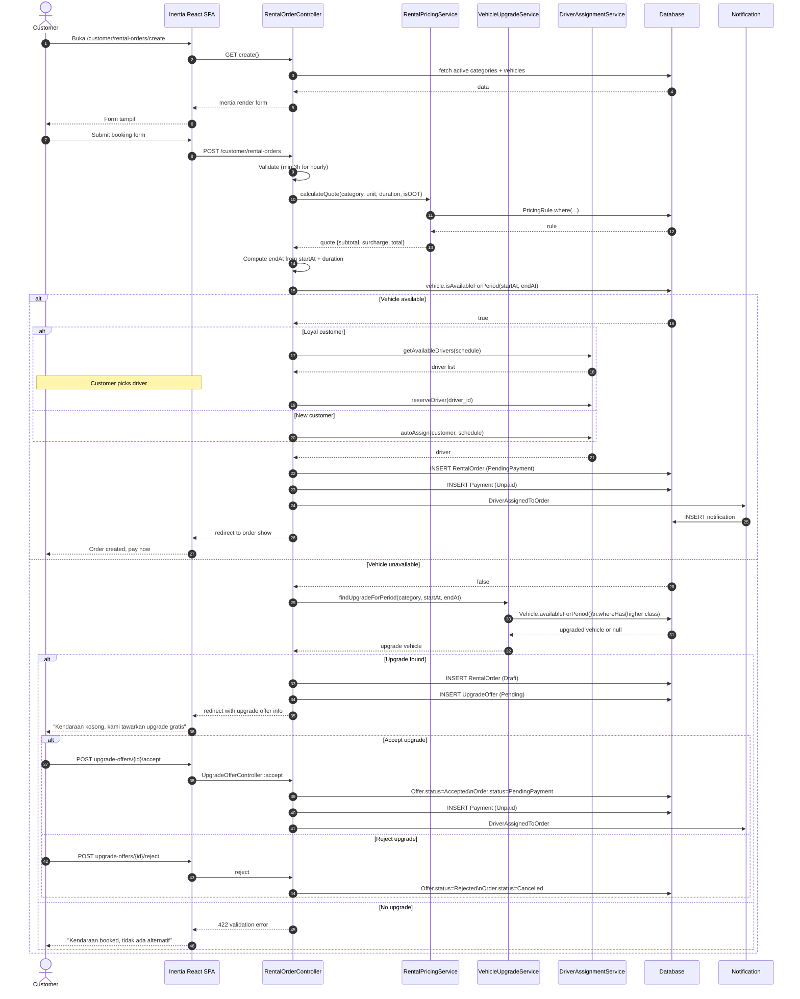

---

## 10. Sequence Diagram — Transfer Verification

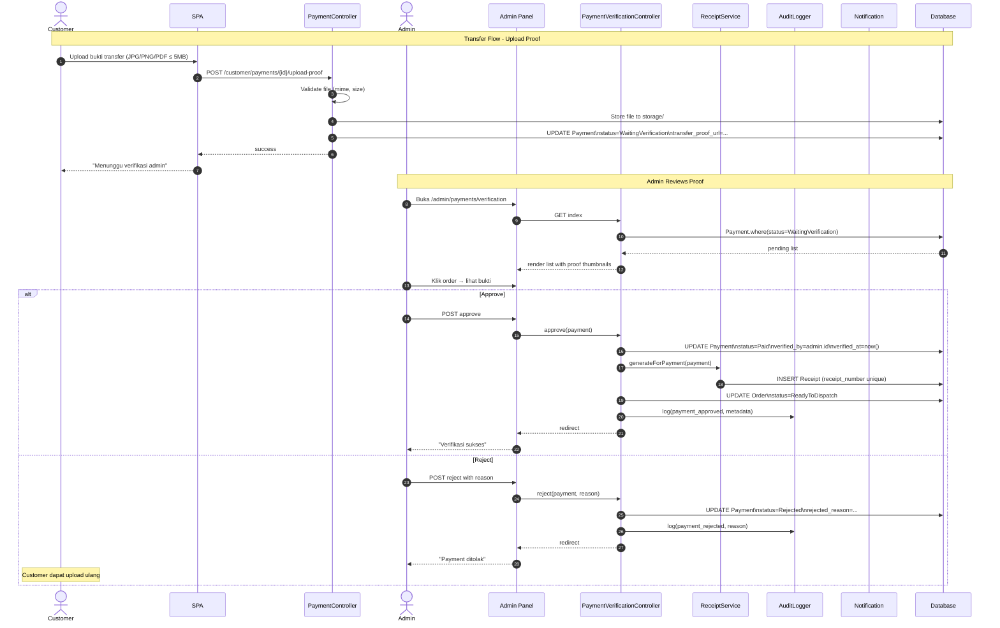

---

## 11. Sequence Diagram — Free Upgrade Flow

Covers Study Case §3 "Auto-Upgrade".

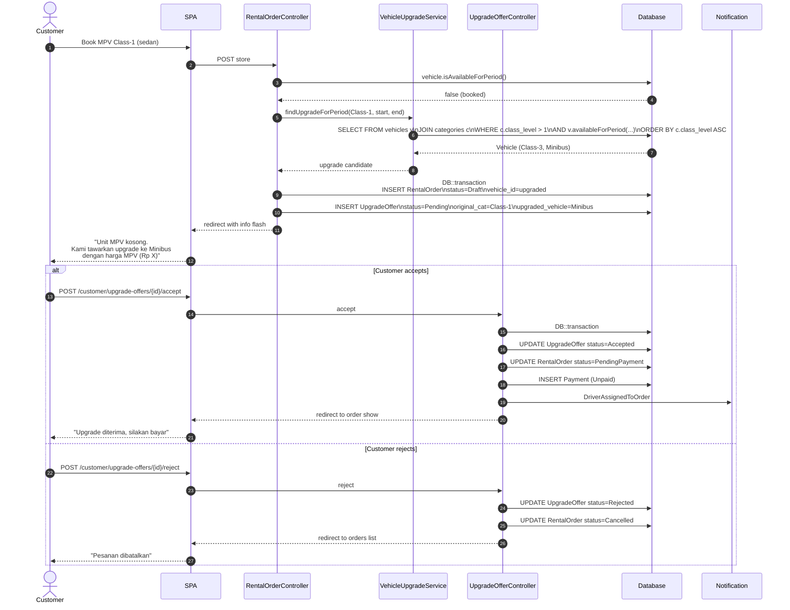

---

## 12. Component Architecture

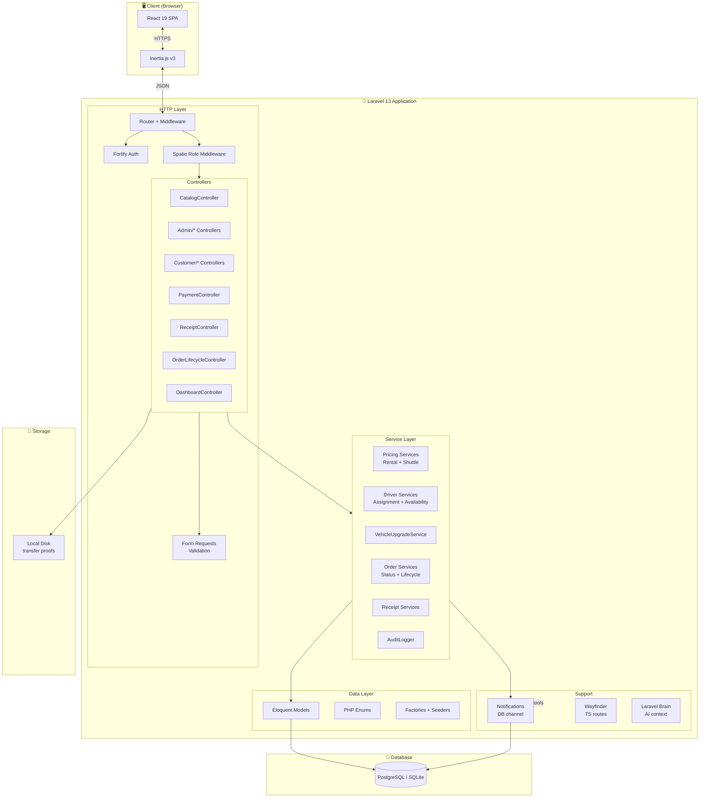

---

## 13. Deployment Diagram

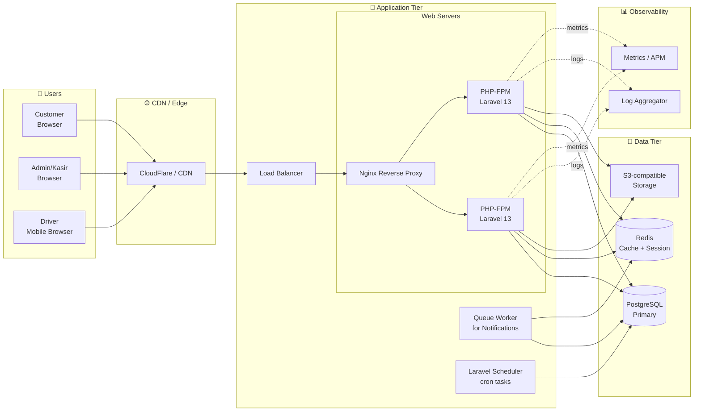

---

## 📌 Rendering Instructions

### GitHub / GitLab

Diagrams otomatis ter-render di Markdown viewer.

### VS Code

Install extension: **"Markdown Preview Mermaid Support"** by bierner.

### Export to PNG/SVG

```bash
npm install -g @mermaid-js/mermaid-cli
mmdc -i docs/UML_MERMAID.md -o docs/UML_MERMAID.pdf
```

Atau online: https://mermaid.live/

---

## 📚 Referensi Silang

| Dokumen             | Path                                                     | Relasi             |
| ------------------- | -------------------------------------------------------- | ------------------ |
| Study Case awal     | `docs/STUDY_CASE.md`                                     | Source requirement |
| MVP Final           | `docs/MVP_FINAL.md`                                      | Scope delivered    |
| Guide Book          | `docs/GUIDE_BOOK.md`                                     | User manual        |
| UML Design (target) | `docs/UML_Rental_Kendaraan_PlantUML/`                    | Original PlantUML  |
| UML As-Built        | `docs/UML_FINAL/`                                        | PlantUML actual    |
| Gap Analysis        | `docs/superpowers/analysis/consolidated-gap-analysis.md` | Gap report         |
| Execution Plan      | `docs/superpowers/plans/uml-alignment-plan.md`           | Delivered tasks    |

---

**Maintained by:** Development Team
**Generated:** 2026-05-09
**Last test run:** 57/57 passing · 168 assertions
