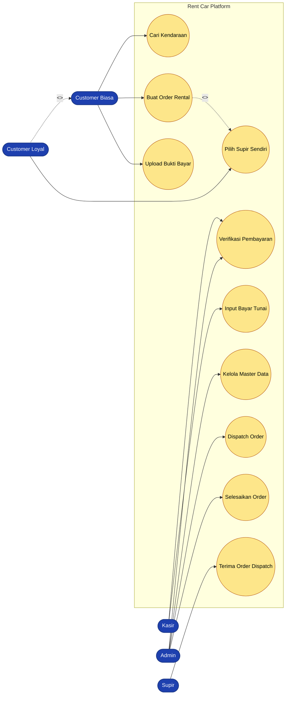
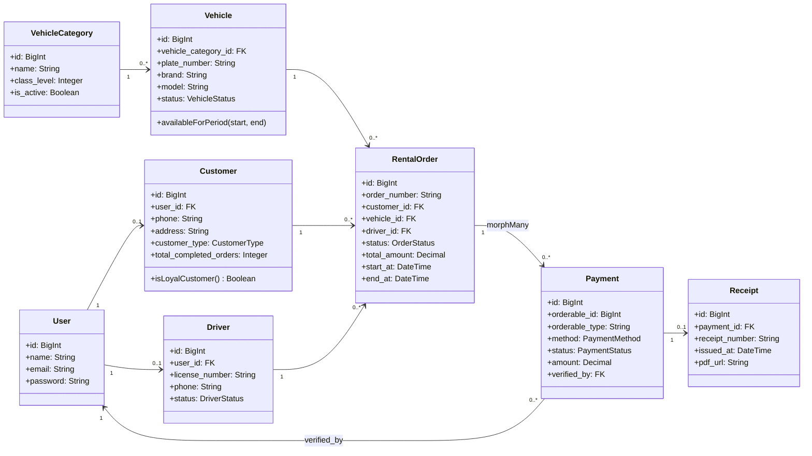
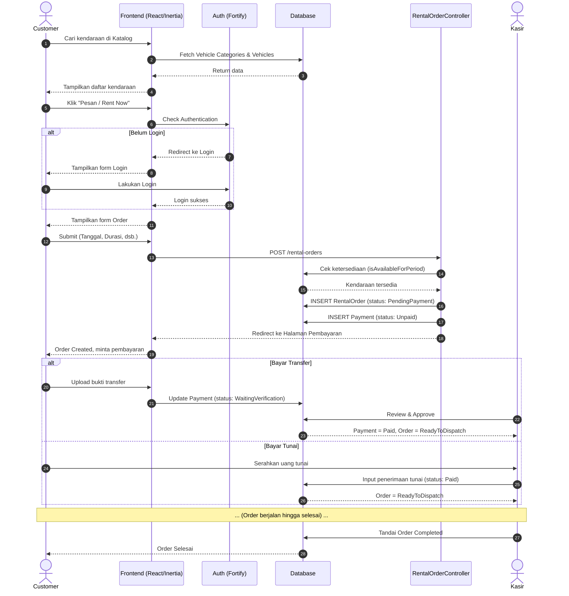
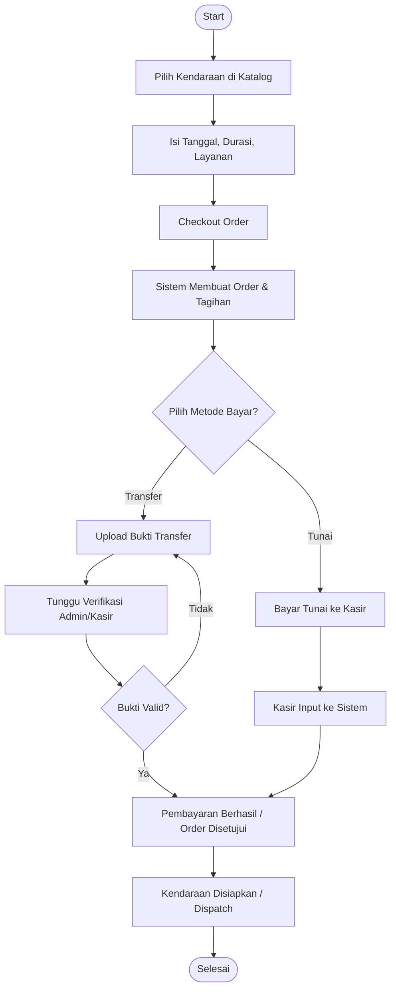

# 🧩 UML Mermaid — Rent Car Platform

> **Version:** 1.2 (LATEST)
> **Last Updated:** 2026-05-12
> **Format:** Mermaid.js

---

## 1. Use Case Diagram

**Deskripsi:**
Diagram Use Case ini memetakan interaksi 5 aktor utama (Customer Biasa, Customer Loyal, Admin, Kasir, dan Supir) dengan sistem. Customer Loyal memiliki hak istimewa (use case tambahan) untuk dapat memilih supir sendiri saat membuat order rental. Admin dan Kasir berbagi tugas dalam memverifikasi pembayaran.

---

## 2. Class Diagram

**Deskripsi:**
Diagram Class menunjukkan struktur entitas inti (Core Entities) sistem berdasarkan implementasi model di Laravel. `RentalOrder` merupakan pusat transaksi yang mengikat `Customer`, `Vehicle`, dan `Driver`. `RentalOrder` juga dapat memiliki transaksi `Payment` (polymorphic) yang setiap pembayaran suksesnya berelasi 1-to-1 dengan `Receipt`.

---

## 3. Sequence Diagram (Flow Order Rental Kendaraan)

**Deskripsi:**
Sequence Diagram ini menggambarkan alur dari sisi interaksi sistem. Customer mulai dari pencarian kendaraan, lalu sistem memastikan status autentikasi sebelum memproses pesanan. Saat order terbentuk (Create Order), customer diminta membayar. Proses diakhiri dengan verifikasi oleh Kasir (baik online transfer maupun offline tunai) hingga order dilabeli selesai.

---

## 4. Activity Diagram (Alur Pemesanan & Pembayaran)

**Deskripsi:**
Activity Diagram di atas merangkum seluruh tahapan alur pengguna (user journey). Alur berjalan dari aktivitas mencari unit yang cocok, melakukan checkout, menyeleksi cabang metode pembayaran dan pelunasannya, berujung pada dispatch kendaraan kepada pelanggan hingga keseluruhan proses sewa selesai.
