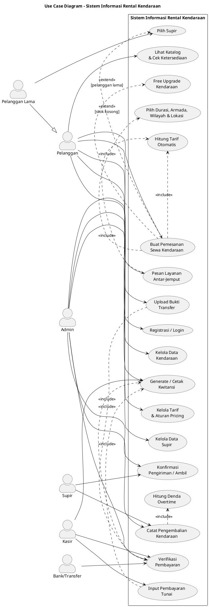
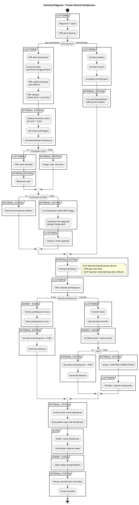
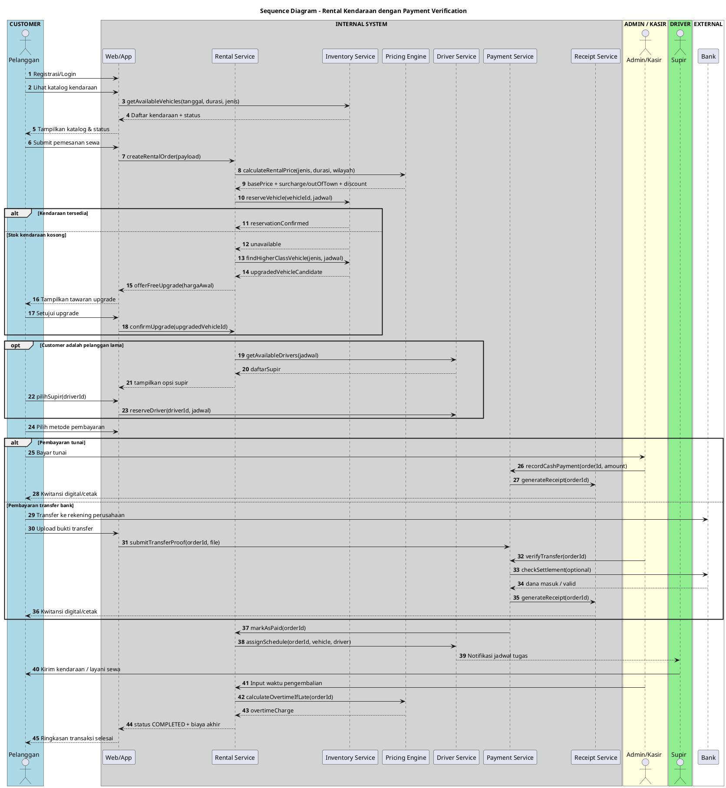
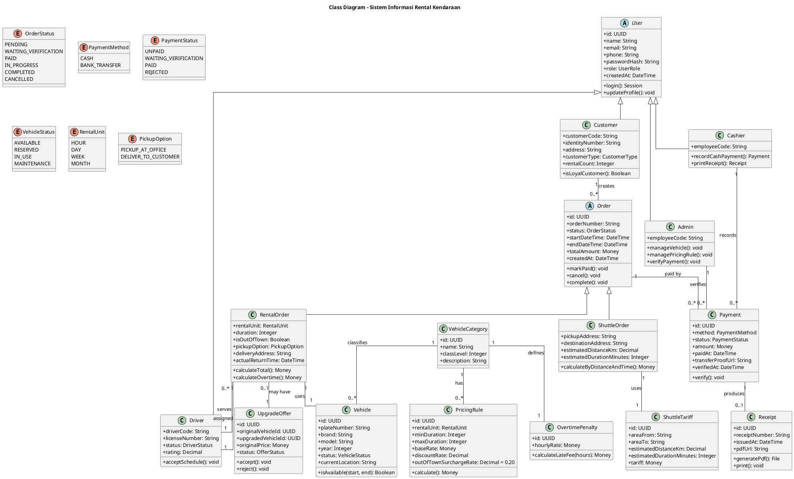

# UML Sistem Informasi Rental Kendaraan

Dokumen ini merepresentasikan requirement final sistem rental kendaraan dalam format yang mudah dibaca developer dan AI agent.

## Cakupan Diagram

1. **Use Case Diagram** — aktor memakai bentuk UML actor/stick figure.
2. **Activity Diagram** — alur proses end-to-end dari pemesanan sampai transaksi selesai.
3. **Sequence Diagram** — disusun dengan section/group: `CUSTOMER | INTERNAL SYSTEM | ADMIN / KASIR | DRIVER | EXTERNAL`.
4. **Class Diagram** — rancangan entity/domain utama untuk backend dan database.

## Aktor Sistem

| Aktor | Deskripsi |
|---|---|
| Pelanggan | Pengguna umum yang melakukan registrasi, melihat katalog, menyewa kendaraan, pesan antar-jemput, dan melakukan pembayaran. |
| Pelanggan Lama | Spesialisasi dari pelanggan yang memiliki hak memilih supir dan dapat memperoleh prioritas layanan. |
| Admin | Mengelola kendaraan, tarif, supir, verifikasi pembayaran, dan operasional transaksi. |
| Kasir | Mencatat pembayaran tunai, membantu verifikasi pembayaran, dan menerbitkan kwitansi. |
| Supir | Menerima jadwal, membawa kendaraan, dan melaksanakan layanan rental/antar-jemput. |
| Bank/Transfer | Aktor eksternal untuk alur transfer bank dan validasi dana masuk. |

---

## 1. Use Case Diagram

---

## 2. Activity Diagram

---

## 3. Sequence Diagram

Sequence diagram dibuat dengan section/box supaya mudah dipindahkan ke Lucid sebagai kolom/lane:

`CUSTOMER | INTERNAL SYSTEM | ADMIN / KASIR | DRIVER | EXTERNAL`

---

## 4. Class Diagram

---

## Catatan Implementasi untuk Developer

### Status Order

| Status | Makna |
|---|---|
| `PENDING` | Order dibuat tetapi belum dibayar. |
| `WAITING_VERIFICATION` | Bukti transfer sudah diunggah tetapi belum diverifikasi. |
| `PAID` | Pembayaran valid dan order boleh dijalankan. |
| `IN_PROGRESS` | Kendaraan/supir sedang menjalankan layanan. |
| `COMPLETED` | Transaksi selesai. |
| `CANCELLED` | Transaksi dibatalkan. |

### Business Rules Utama

| Rule | Implementasi Sistem |
|---|---|
| Sewa selalu termasuk supir | `RentalOrder` wajib memiliki relasi ke `Driver`. |
| Sewa tanpa BBM | Tidak ada field biaya BBM pada order final. |
| Minimal sewa per jam 3 jam | Validasi pada `RentalService` sebelum order dibuat. |
| Durasi makin lama makin murah | `PricingRule.discountRate` dan `PricingEngine.calculate()`. |
| Luar kota tambah 20% | `PricingRule.outOfTownSurchargeRate = 0.20`. |
| Overtime per jam | `OvertimePenalty.calculateLateFee(hours)`. |
| Pelanggan lama dapat memilih supir | `Customer.isLoyalCustomer()` membuka fitur `chooseDriver`. |
| Kendaraan kosong dapat free upgrade | `UpgradeOffer` dibuat jika stok awal tidak tersedia. |
| Kendaraan tidak boleh dikirim sebelum lunas | `RentalOrder.status` harus `PAID` sebelum dispatch. |
| Transfer sah setelah bukti/dana diverifikasi | `Payment.status` berubah dari `WAITING_VERIFICATION` ke `PAID`. |
| Kwitansi diterbitkan setelah lunas | `ReceiptService.generateReceipt(orderId)`. |

### Modul Sistem yang Disarankan

| Modul | Tanggung Jawab |
|---|---|
| User Management | Registrasi, login, role, histori pelanggan. |
| Vehicle Management | Data kendaraan, kategori, status ketersediaan. |
| Driver Management | Data supir, status supir, assignment jadwal. |
| Rental Transaction | Order rental, durasi, lokasi, wilayah, dispatch, pengembalian. |
| Shuttle Service | Antar-jemput berdasarkan tabel jarak dan waktu. |
| Pricing Engine | Tarif dinamis, surcharge luar kota, overtime. |
| Payment System | Tunai, transfer, verifikasi pembayaran. |
| Reporting & Document | Kwitansi digital/cetak dan laporan transaksi. |

