# Manual Book — Rent-Car (Urban8) UML AS-BUILT E2E Walkthrough

> **Generated**: 2026-05-24 21:09:31
> **Source**: `tests/qa/run-e2e-walkthrough.mjs` — Playwright headless Chromium, viewport **1920×1080**, full-page screenshots
> **Coverage**: 27 use case (UC-01 ... UC-27) sesuai `docs/UML_FINAL/02_use_case_diagram_as_built.puml`
> **Test target**: `http://localhost:8080` (rent-car-dev docker stack)
> **Seeder accounts** (password = `password`):
> - Admin: `admin@urban8.com`
> - Kasir: `kasir@urban8.com`
> - Customer (existing): `customer@urban8.com`, `loyal@urban8.com`
> - Driver: `driver@urban8.com`
> - Customer baru di-register otomatis di tiap run

## Ringkasan

| Metric | Value |
|---|---|
| Total cases | 55 |
| ✅ Pass | 54 |
| ⏭️ Skip | 1 |
| ❌ Fail | 0 |

## UC-01 — Registrasi / Login

### Halaman Registrasi Customer

- **Status**: ✅ PASS
- **URL/Menu**: `/register`
- **Component**: Form registrasi
- **Kondisi**: Initial render
- **Screenshot**:

  

### Form Registrasi Filled

- **Status**: ✅ PASS
- **URL/Menu**: `/register`
- **Component**: Form filled
- **Kondisi**: Filled with valid data
- **Screenshot**:

  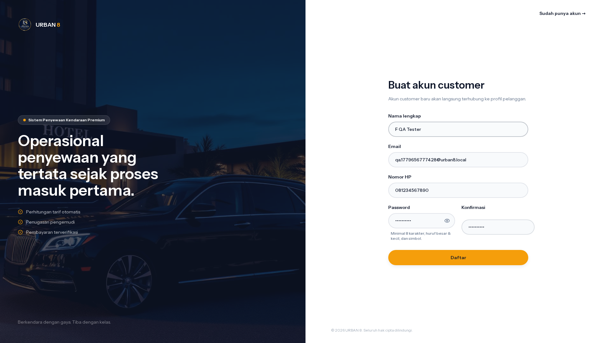

### After Register Submit

- **Status**: ✅ PASS
- **URL/Menu**: `/register`
- **Component**: Submit success
- **Kondisi**: Setelah register sukses
- **Notes**: Email: qa.1779656777428@urban8.local
- **Screenshot**:

  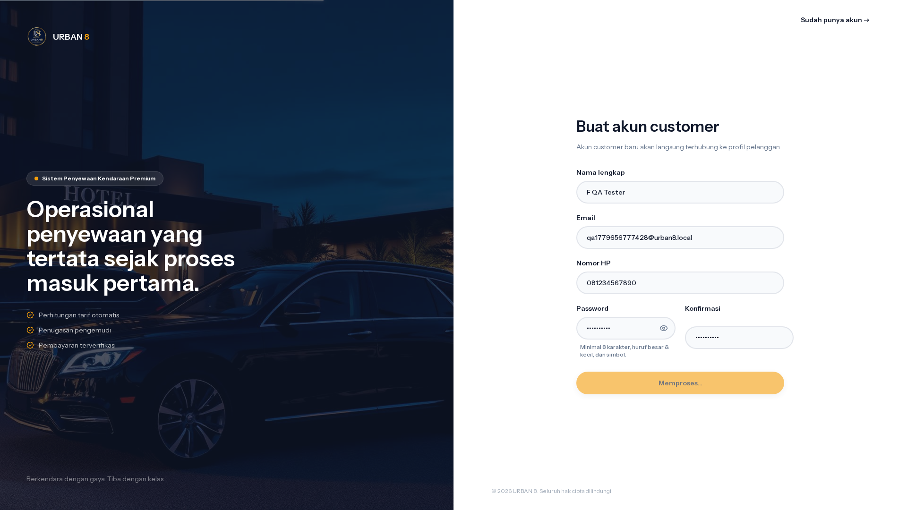

### Halaman Login

- **Status**: ✅ PASS
- **URL/Menu**: `/login`
- **Component**: Form login
- **Kondisi**: Initial
- **Screenshot**:

  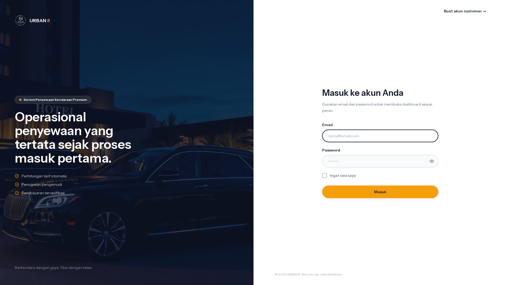

## UC-02 — Browse Katalog & Lihat Detail

### Browse Katalog (publik)

- **Status**: ✅ PASS
- **URL/Menu**: `/catalog`
- **Component**: List kategori/kendaraan
- **Kondisi**: Anonymous browse
- **Screenshot**:

  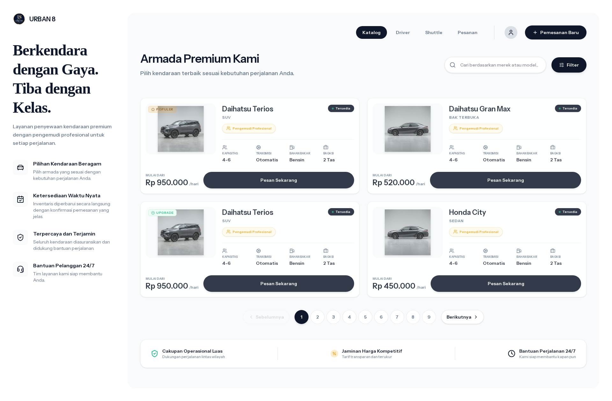

### Detail Kategori/Kendaraan

- **Status**: ✅ PASS
- **URL/Menu**: `/catalog`
- **Component**: Halaman detail
- **Kondisi**: Click katalog item
- **Screenshot**:

  

## UC-03 — Buat Order Sewa Kendaraan

### Non-loyal customer — Mulai Buat Order

- **Status**: ✅ PASS
- **URL/Menu**: `/catalog`
- **Component**: Catalog list (logged-in)
- **Kondisi**: Customer logged-in browsing
- **Screenshot**:

  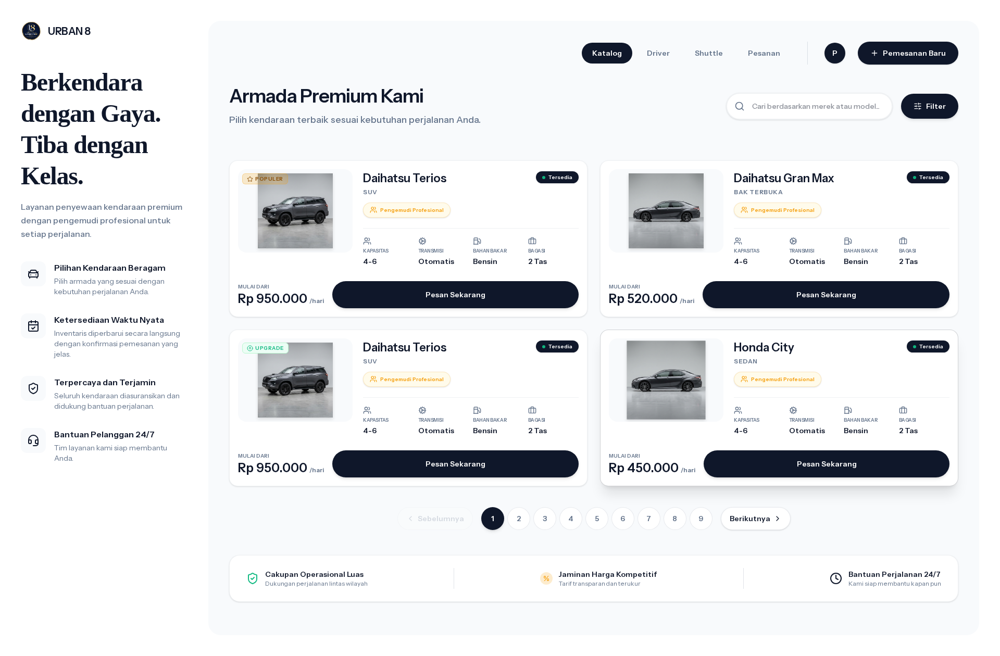

### Non-loyal customer — Modal Order Step 1 Detail

- **Status**: ✅ PASS
- **URL/Menu**: `/catalog`
- **Component**: Vehicle order modal
- **Kondisi**: Step 1 Detail kendaraan
- **Screenshot**:

  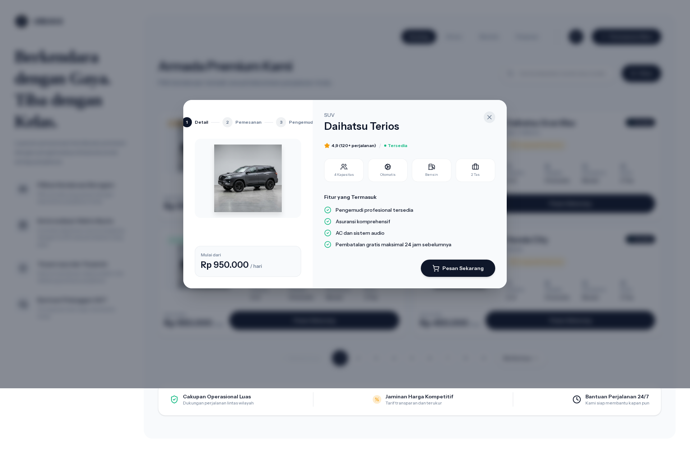

### Loyal customer — Mulai Buat Order

- **Status**: ✅ PASS
- **URL/Menu**: `/catalog`
- **Component**: Catalog list (logged-in)
- **Kondisi**: Customer logged-in browsing
- **Screenshot**:

  

### Loyal customer — Modal Order Step 1 Detail

- **Status**: ✅ PASS
- **URL/Menu**: `/catalog`
- **Component**: Vehicle order modal
- **Kondisi**: Step 1 Detail kendaraan
- **Screenshot**:

  

## UC-04 — Pilih Durasi, Unit, Wilayah, Lokasi

### Non-loyal customer — Modal Order Step 2 Form Sewa

- **Status**: ✅ PASS
- **URL/Menu**: `/catalog`
- **Component**: Order form fields
- **Kondisi**: Step 2 Durasi/unit/waktu/lokasi
- **Screenshot**:

  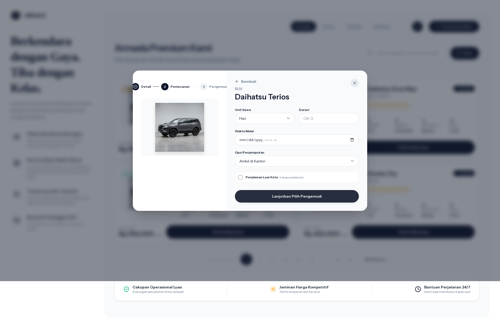

### Loyal customer — Modal Order Step 2 Form Sewa

- **Status**: ✅ PASS
- **URL/Menu**: `/catalog`
- **Component**: Order form fields
- **Kondisi**: Step 2 Durasi/unit/waktu/lokasi
- **Screenshot**:

  

## UC-05 — Hitung Tarif Otomatis

### Non-loyal customer — Modal Order Step 2 Hitung Tarif

- **Status**: ✅ PASS
- **URL/Menu**: `/catalog`
- **Component**: Auto-quote panel
- **Kondisi**: Estimasi total muncul setelah durasi diisi
- **Screenshot**:

  

### Loyal customer — Modal Order Step 2 Hitung Tarif

- **Status**: ✅ PASS
- **URL/Menu**: `/catalog`
- **Component**: Auto-quote panel
- **Kondisi**: Estimasi total muncul setelah durasi diisi
- **Screenshot**:

  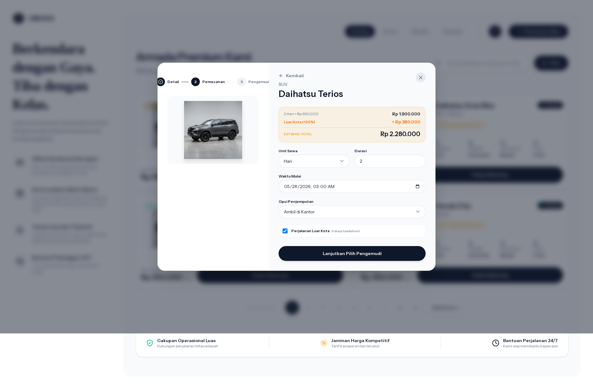

## UC-06 — Pilih Supir

### Non-loyal customer — Modal Order Step 3 Pilih Supir

- **Status**: ✅ PASS
- **URL/Menu**: `/catalog`
- **Component**: Driver selection in order modal
- **Kondisi**: Driver cards tetap tampil tapi disabled
- **Screenshot**:

  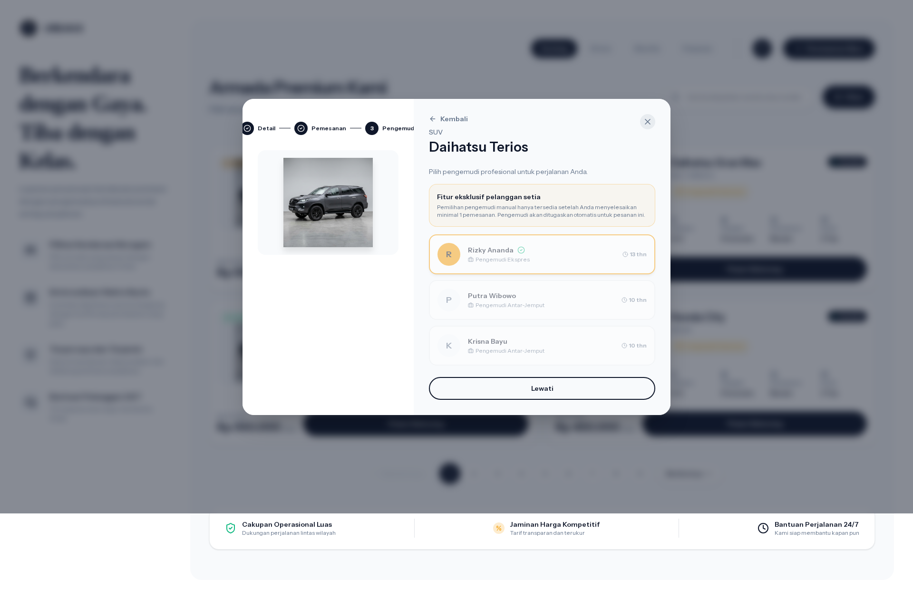

### Loyal customer — Modal Order Step 3 Pilih Supir

- **Status**: ✅ PASS
- **URL/Menu**: `/catalog`
- **Component**: Driver selection in order modal
- **Kondisi**: Driver cards selectable untuk loyal customer
- **Screenshot**:

  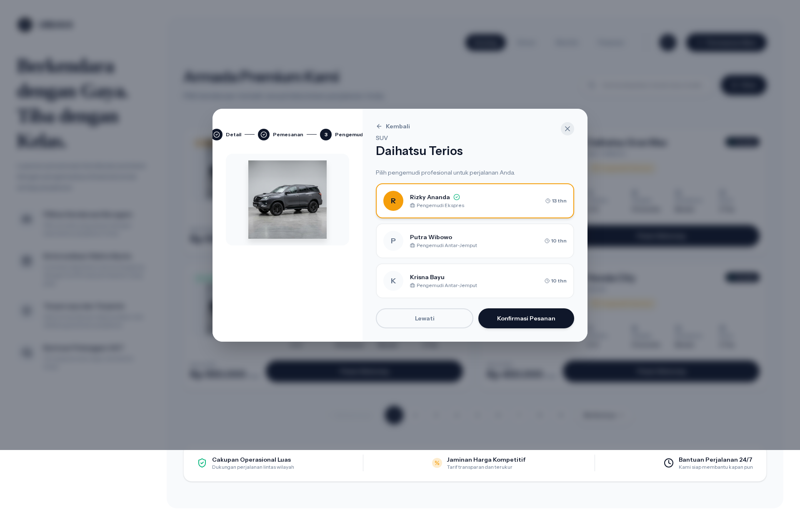

### Daftar Supir (loyal customer dapat memilih)

- **Status**: ✅ PASS
- **URL/Menu**: `/drivers`
- **Component**: Driver list
- **Kondisi**: Render
- **Screenshot**:

  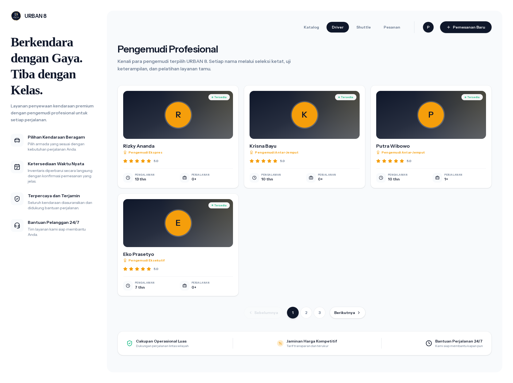

## UC-08 — Pesan Layanan Antar-Jemput

### Form Pesan Shuttle

- **Status**: ✅ PASS
- **URL/Menu**: `/shuttle`
- **Component**: Form shuttle
- **Kondisi**: Render form
- **Screenshot**:

  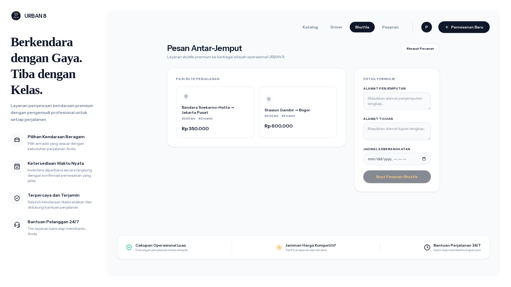

## UC-11 — Verifikasi Transfer

### Halaman Verifikasi Transfer (Admin)

- **Status**: ✅ PASS
- **URL/Menu**: `/admin/payments/verification`
- **Component**: Pending verification list
- **Kondisi**: Render verifikasi list
- **Screenshot**:

  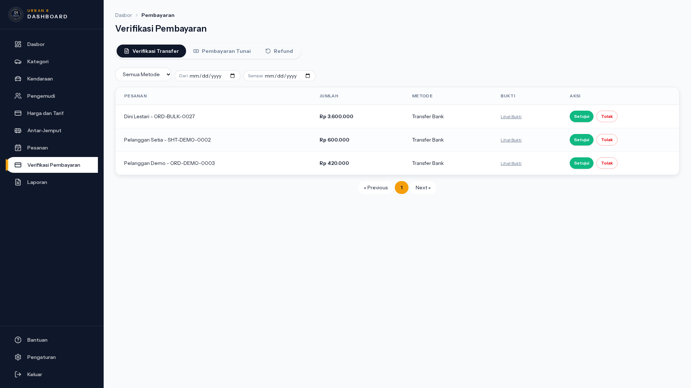

### Modal Verifikasi Pembayaran (Setujui)

- **Status**: ✅ PASS
- **URL/Menu**: `/admin/payments/verification`
- **Component**: Approve payment dialog
- **Kondisi**: Trigger row "Setujui"
- **Screenshot**:

  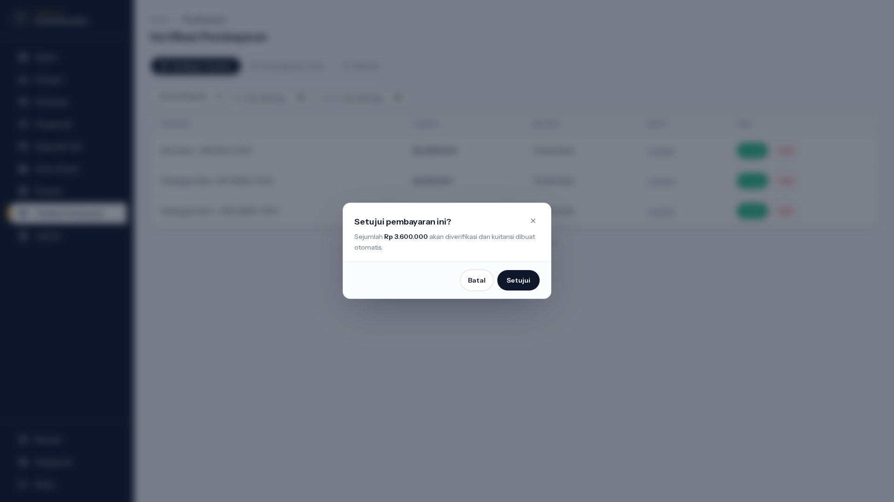

### Modal Tolak Pembayaran

- **Status**: ✅ PASS
- **URL/Menu**: `/admin/payments/verification`
- **Component**: Reject payment dialog
- **Kondisi**: Trigger row "Tolak"
- **Screenshot**:

  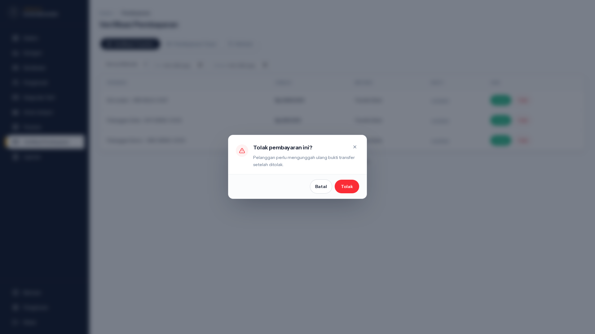

### Verifikasi Transfer (Kasir)

- **Status**: ✅ PASS
- **URL/Menu**: `/admin/payments/verification`
- **Component**: Verifikasi tabs
- **Kondisi**: Render
- **Screenshot**:

  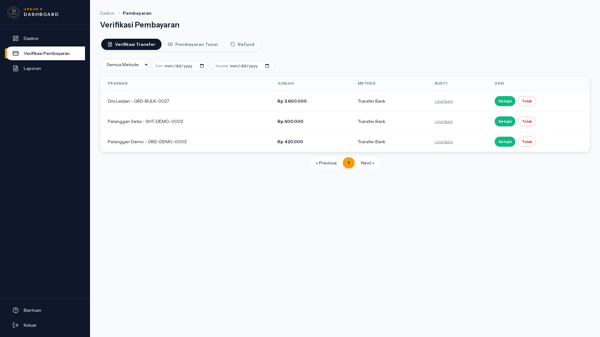

## UC-12 — Generate Kwitansi (digital)

### Generate Kwitansi (link receipt visible)

- **Status**: ✅ PASS
- **URL/Menu**: `/admin/payments/verification`
- **Component**: Receipt link visible
- **Kondisi**: List dengan tombol Lihat Bukti/Kwitansi
- **Screenshot**:

  

## UC-13 — Kelola Kendaraan & Kategori

### Kelola Kendaraan (List)

- **Status**: ✅ PASS
- **URL/Menu**: `/admin/vehicles`
- **Component**: Vehicles index
- **Kondisi**: List render
- **Screenshot**:

  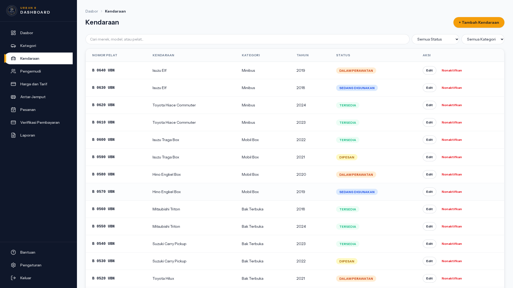

### Modal Tambah Kendaraan

- **Status**: ✅ PASS
- **URL/Menu**: `/admin/vehicles`
- **Component**: Add vehicle dialog
- **Kondisi**: Trigger tombol "+ Tambah Kendaraan"
- **Screenshot**:

  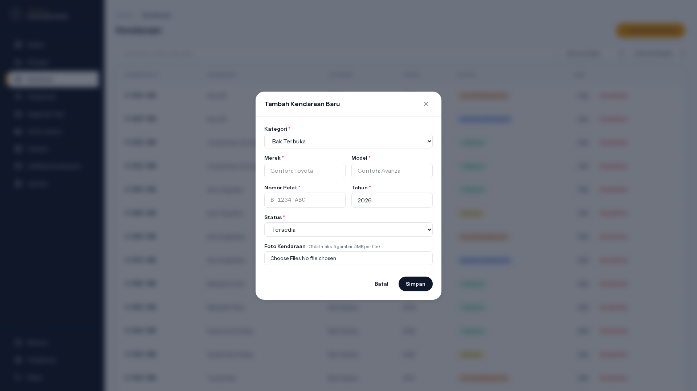

### Modal Edit Kendaraan

- **Status**: ✅ PASS
- **URL/Menu**: `/admin/vehicles`
- **Component**: Edit vehicle dialog
- **Kondisi**: Trigger row "Edit"
- **Screenshot**:

  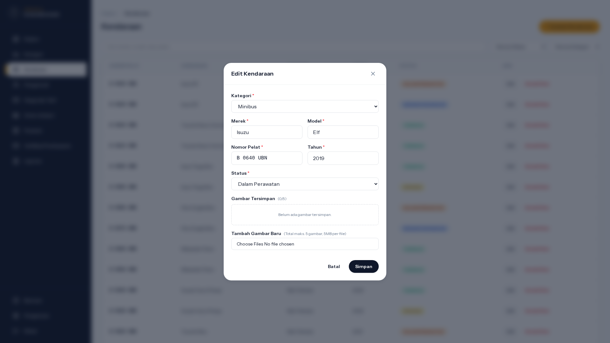

### Kelola Kategori Kendaraan (List)

- **Status**: ✅ PASS
- **URL/Menu**: `/admin/vehicle-categories`
- **Component**: Categories index
- **Kondisi**: List render
- **Screenshot**:

  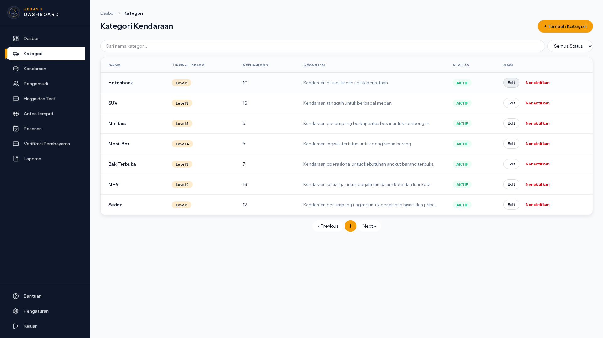

### Modal Tambah Kategori

- **Status**: ✅ PASS
- **URL/Menu**: `/admin/vehicle-categories`
- **Component**: Add category dialog
- **Kondisi**: Trigger tombol Tambah
- **Screenshot**:

  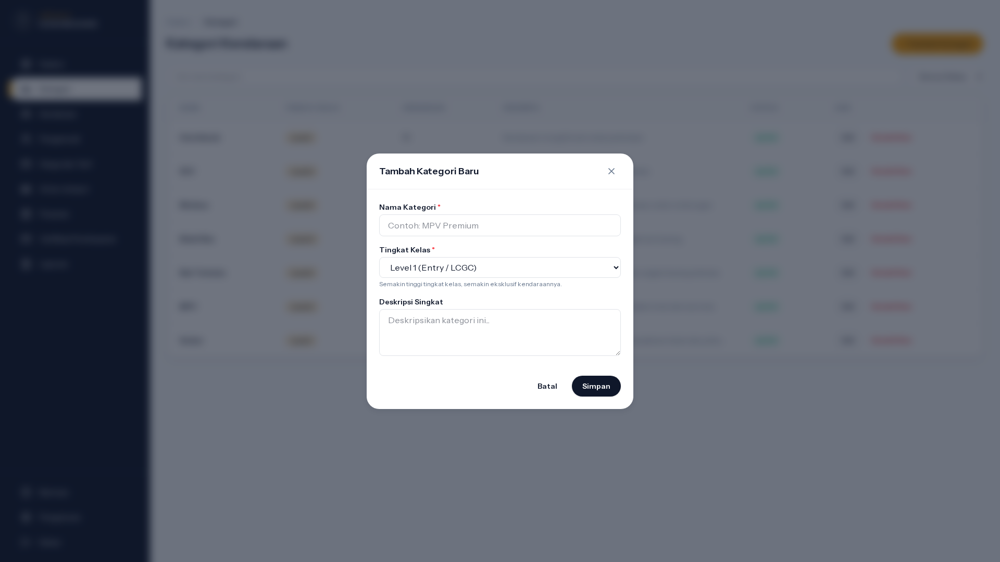

## UC-14 — Kelola Pricing Rule & Overtime Penalty

### Kelola Pricing Rule (List + Form Inline)

- **Status**: ✅ PASS
- **URL/Menu**: `/admin/pricing-rules`
- **Component**: Pricing rule list + inline form
- **Kondisi**: List render
- **Screenshot**:

  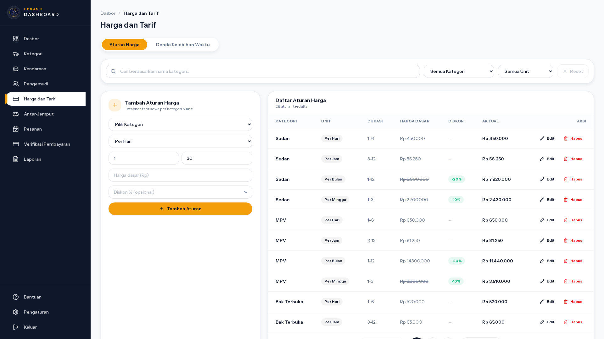

### Modal Edit Pricing Rule

- **Status**: ✅ PASS
- **URL/Menu**: `/admin/pricing-rules`
- **Component**: Edit pricing dialog
- **Kondisi**: Trigger row "Edit"
- **Screenshot**:

  

### Kelola Overtime Penalty (List + Form Inline)

- **Status**: ✅ PASS
- **URL/Menu**: `/admin/pricing-rules`
- **Component**: Overtime tab + inline form
- **Kondisi**: Render
- **Screenshot**:

  

### Modal Edit Overtime Penalty

- **Status**: ✅ PASS
- **URL/Menu**: `/admin/pricing-rules`
- **Component**: Edit overtime dialog
- **Kondisi**: Trigger row "Edit" di tab Overtime
- **Screenshot**:

  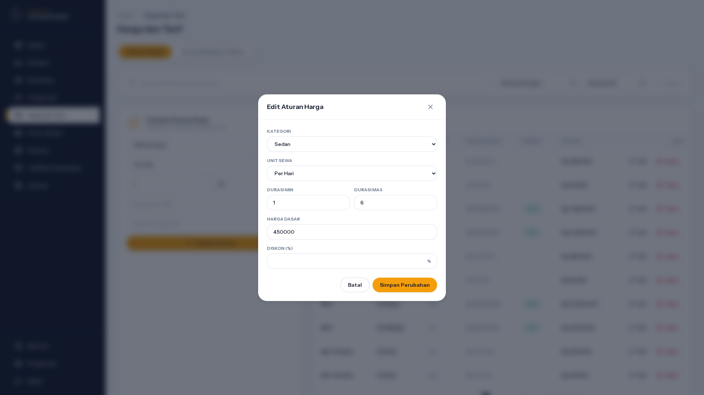

## UC-15 — Kelola Data Supir

### Kelola Data Supir (List)

- **Status**: ✅ PASS
- **URL/Menu**: `/admin/drivers`
- **Component**: Drivers index
- **Kondisi**: List render
- **Screenshot**:

  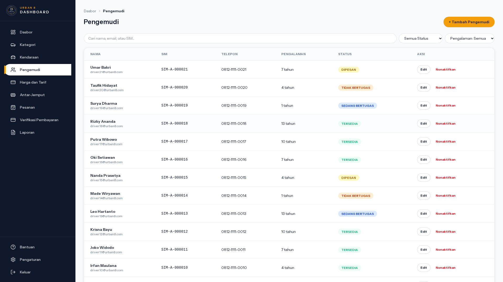

### Modal Tambah Supir

- **Status**: ✅ PASS
- **URL/Menu**: `/admin/drivers`
- **Component**: Add driver dialog
- **Kondisi**: Trigger "+ Tambah Pengemudi"
- **Screenshot**:

  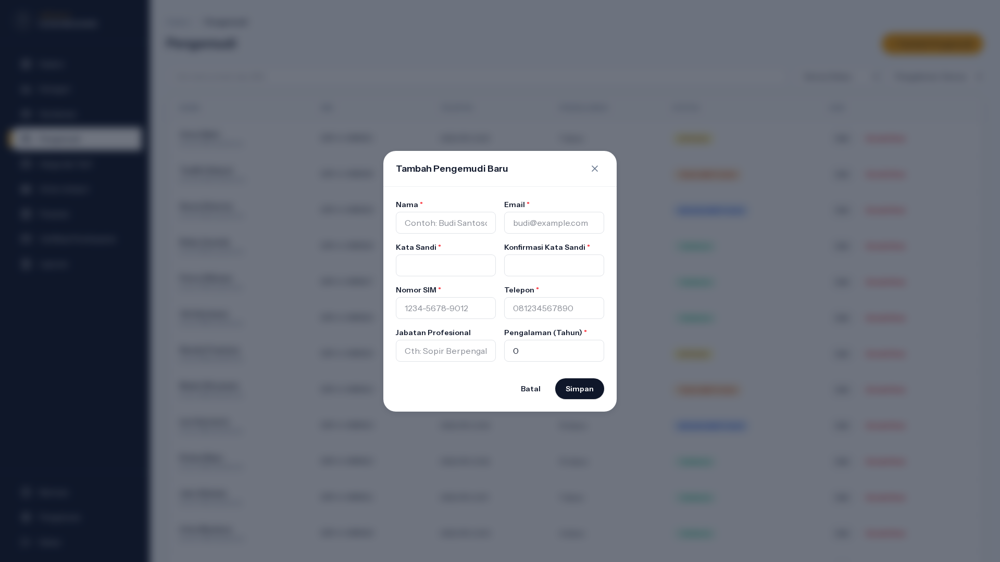

## UC-16 — Dispatch Order (payment-locked)

### Admin Order Lifecycle — List

- **Status**: ✅ PASS
- **URL/Menu**: `/admin/orders`
- **Component**: Orders index
- **Kondisi**: List render
- **Screenshot**:

  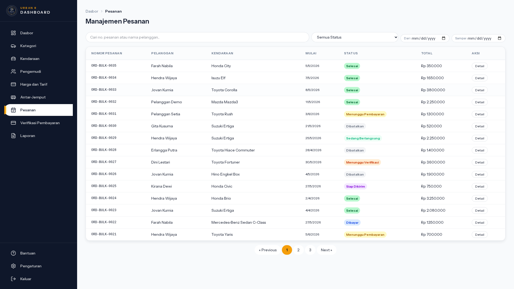

### Admin Order Lifecycle — Detail (ReadyToDispatch)

- **Status**: ✅ PASS
- **URL/Menu**: `/admin/orders/ORD-DEMO-0004`
- **Component**: Action buttons
- **Kondisi**: Detail render
- **Screenshot**:

  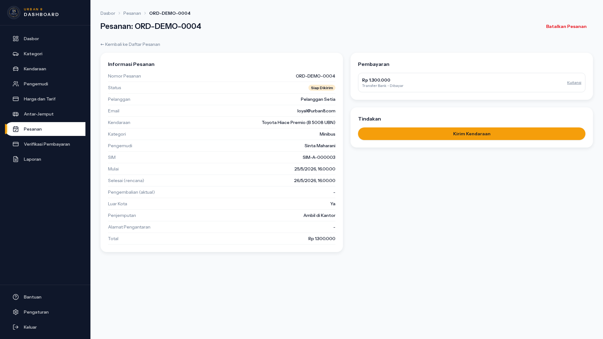

### Modal Kirim Kendaraan (Dispatch)

- **Status**: ✅ PASS
- **URL/Menu**: `/admin/orders/ORD-DEMO-0004`
- **Component**: Dispatch dialog
- **Kondisi**: Trigger "Kirim Kendaraan"
- **Screenshot**:

  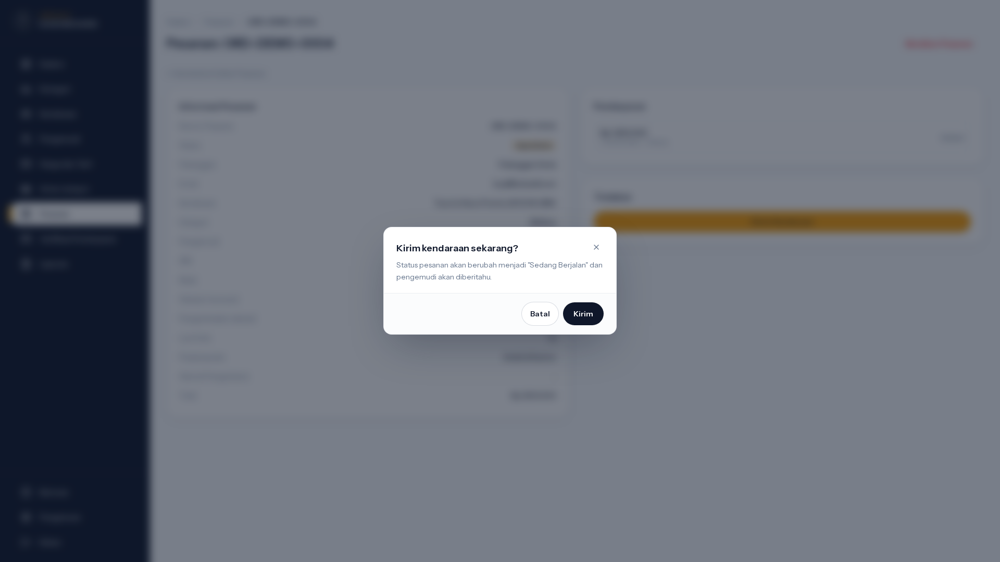

### Modal Cancel Order (Admin)

- **Status**: ✅ PASS
- **URL/Menu**: `/admin/orders/ORD-DEMO-0004`
- **Component**: Cancel order dialog
- **Kondisi**: Trigger "Batalkan Pesanan"
- **Screenshot**:

  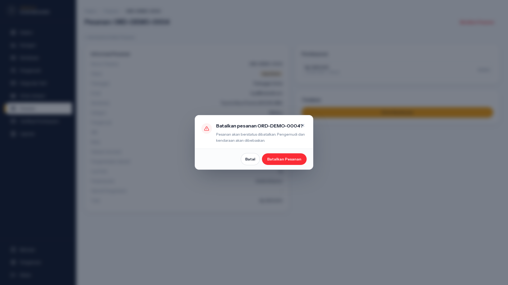

## UC-17 — Catat Return & Aktual Time

### Admin Order — Form Catat Return (Ongoing)

- **Status**: ✅ PASS
- **URL/Menu**: `/admin/orders/ORD-DEMO-0005`
- **Component**: Return form (inline)
- **Kondisi**: Render form pengembalian
- **Screenshot**:

  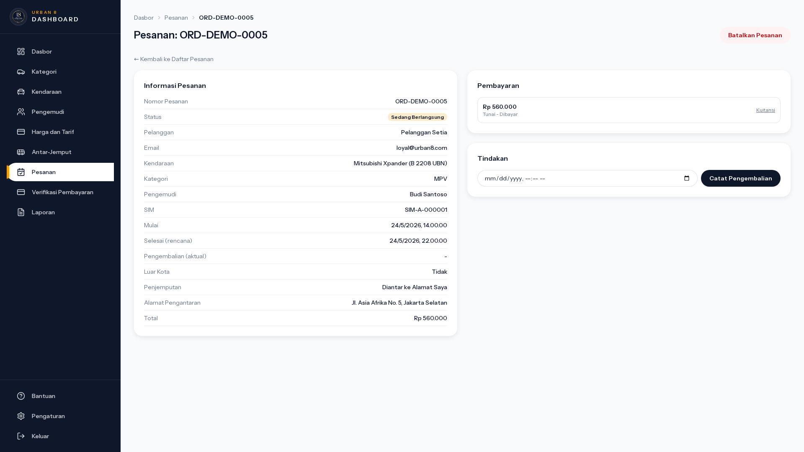

## UC-18 — Hitung Overtime (kelipatan jam)

### Hitung Overtime (panel di detail)

- **Status**: ✅ PASS
- **URL/Menu**: `/admin/orders/ORD-DEMO-0004`
- **Component**: Overtime panel
- **Kondisi**: Display
- **Screenshot**:

  

## UC-19 — Kelola Tarif Shuttle

### Kelola Tarif Shuttle (List + Form Inline)

- **Status**: ✅ PASS
- **URL/Menu**: `/admin/shuttle-tariffs`
- **Component**: Shuttle tariff list + inline form
- **Kondisi**: List render
- **Screenshot**:

  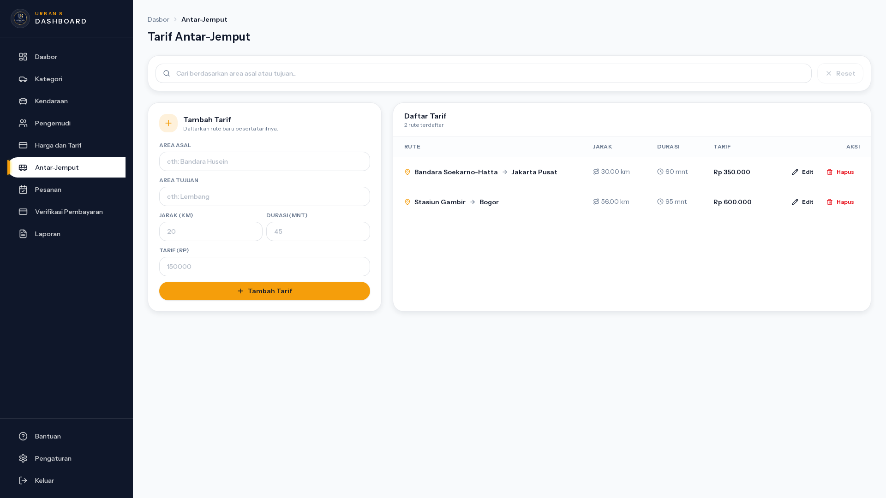

### Modal Edit Tarif Shuttle

- **Status**: ✅ PASS
- **URL/Menu**: `/admin/shuttle-tariffs`
- **Component**: Edit shuttle dialog
- **Kondisi**: Trigger row "Edit"
- **Screenshot**:

  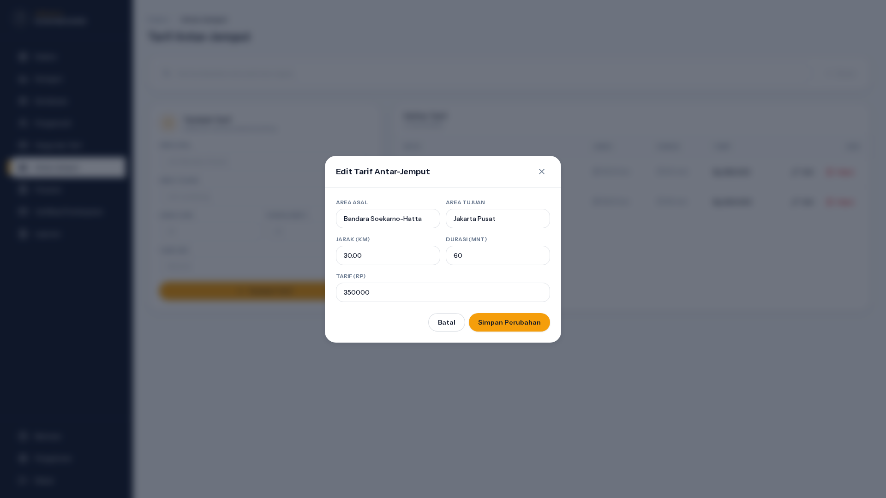

## UC-20 — Complete Order

### Admin Order — Detail (WaitingOvertimePayment)

- **Status**: ✅ PASS
- **URL/Menu**: `/admin/orders/ORD-DEMO-0006`
- **Component**: Complete button
- **Kondisi**: Detail render dengan tombol Complete
- **Screenshot**:

  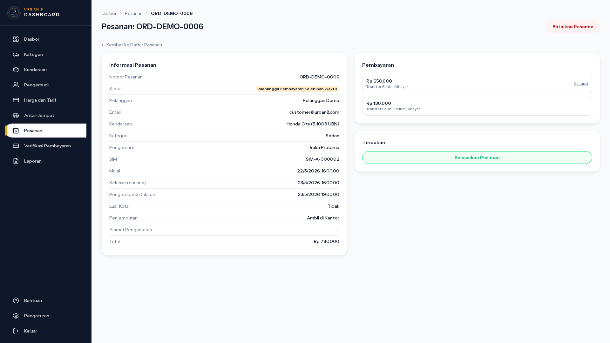

### Modal Complete Order

- **Status**: ✅ PASS
- **URL/Menu**: `/admin/orders/ORD-DEMO-0006`
- **Component**: Complete dialog
- **Kondisi**: Trigger "Selesaikan Pesanan"
- **Screenshot**:

  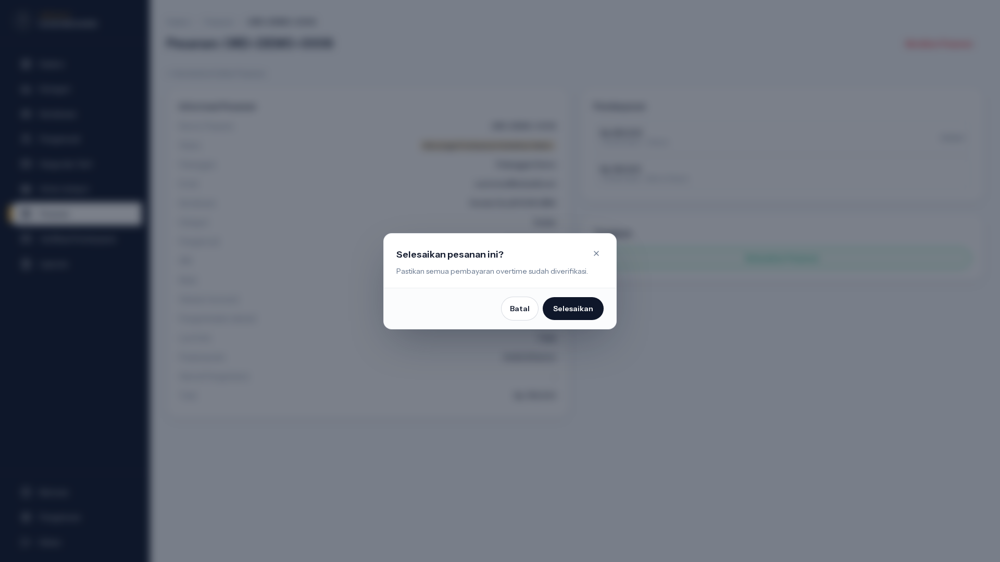

## UC-21 — Lihat Dashboard Operasional

### Admin Dashboard Operasional

- **Status**: ✅ PASS
- **URL/Menu**: `/admin/dashboard`
- **Component**: KPI cards + chart
- **Kondisi**: Render dashboard
- **Screenshot**:

  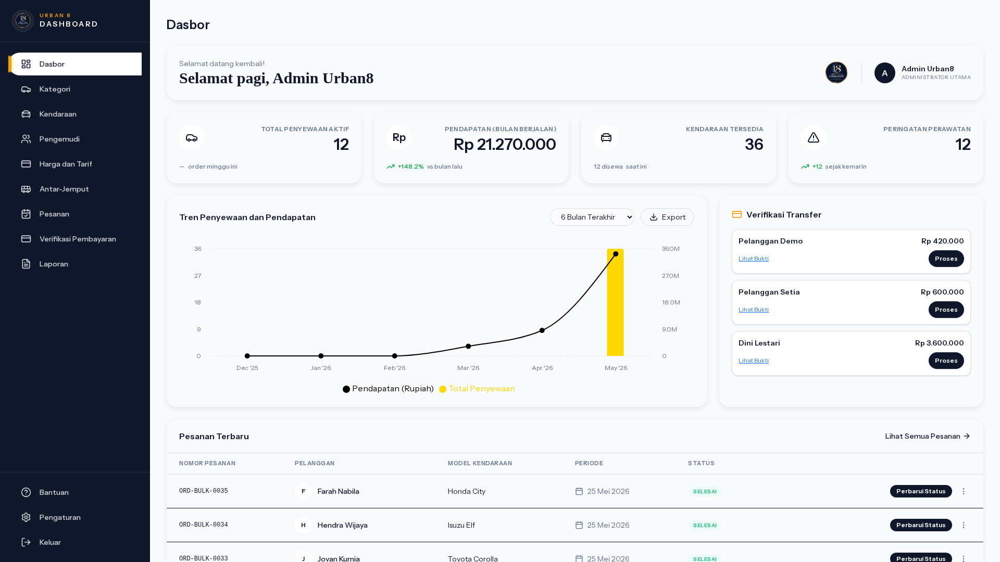

## UC-22 — Generate Laporan Transaksi & Revenue

### Generate Laporan Transaksi & Revenue

- **Status**: ✅ PASS
- **URL/Menu**: `/admin/reports`
- **Component**: Reports page
- **Kondisi**: Render
- **Screenshot**:

  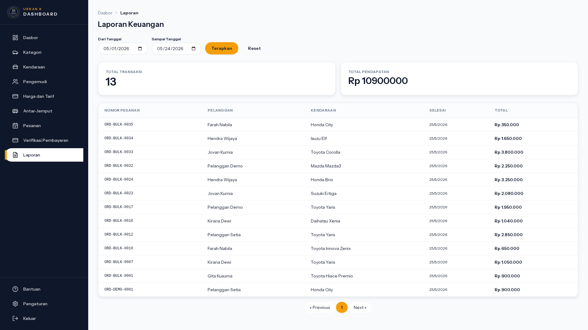

### Admin Settings

- **Status**: ✅ PASS
- **URL/Menu**: `/admin/settings`
- **Component**: Settings page
- **Kondisi**: Render
- **Screenshot**:

  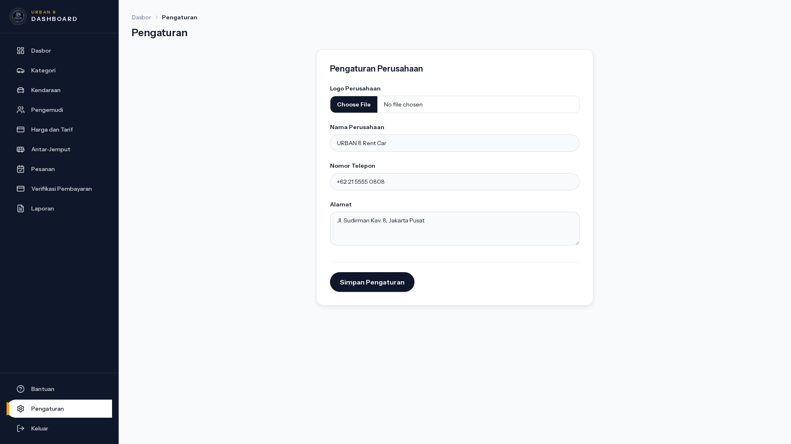

## UC-23 — View Audit Log (internal)

### View Audit Log (route belum ter-expose)

- **Status**: ⏭️ SKIP
- **URL/Menu**: `/admin/dashboard`
- **Component**: Audit log surface
- **Kondisi**: Tidak ada route admin/audit-logs
- **Notes**: Audit log via service AuditLogger; tidak ada UI list eksplisit
- **Screenshot**:

  

## UC-25 — Lihat Riwayat Order

### Riwayat Order Customer

- **Status**: ✅ PASS
- **URL/Menu**: `/orders`
- **Component**: Orders list
- **Kondisi**: Render list
- **Screenshot**:

  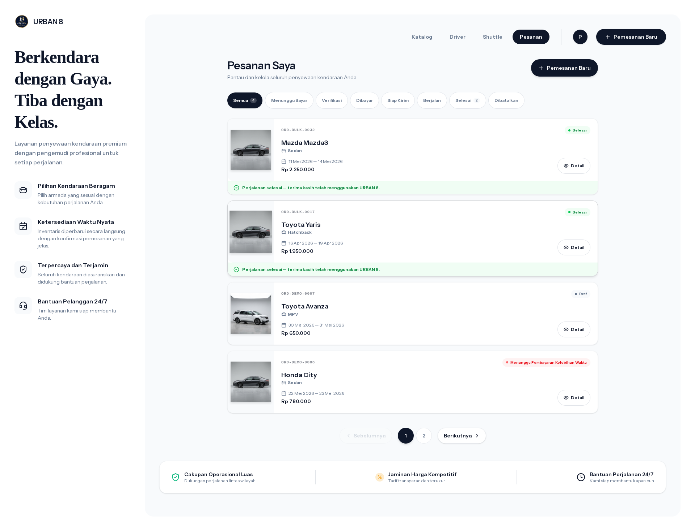

## UC-26 — Pilih Role Dashboard (role-based redirect)

### Dashboard Customer (role redirect)

- **Status**: ✅ PASS
- **URL/Menu**: `/dashboard`
- **Component**: Auto-redirect
- **Kondisi**: Customer login
- **Screenshot**:

  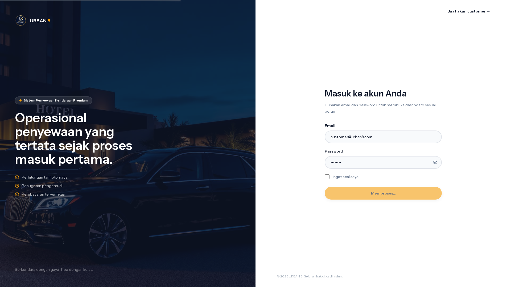

### Role redirect Admin

- **Status**: ✅ PASS
- **URL/Menu**: `/admin/dashboard`
- **Component**: Auto-redirect
- **Kondisi**: Admin login
- **Screenshot**:

  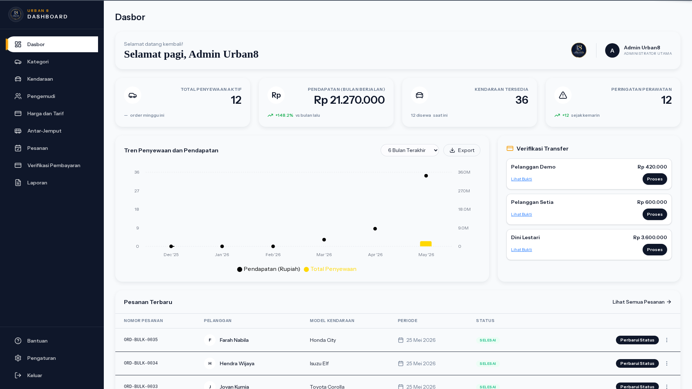

### Role redirect Kasir

- **Status**: ✅ PASS
- **URL/Menu**: `/admin/dashboard`
- **Component**: Auto-redirect
- **Kondisi**: Kasir login
- **Screenshot**:

  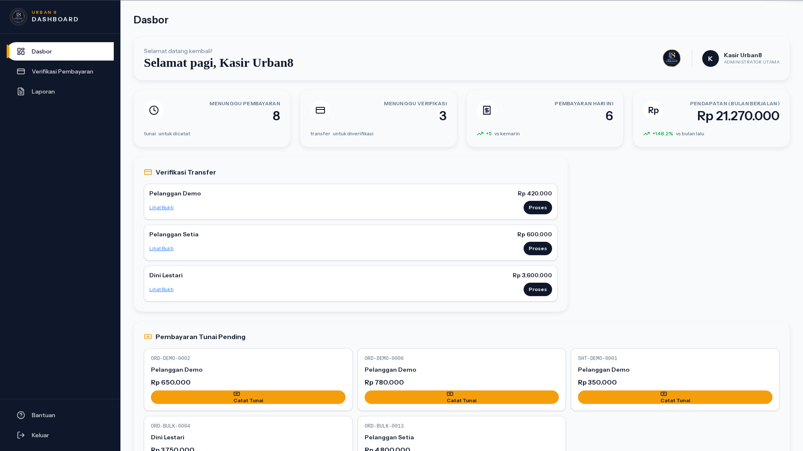

### Role redirect Driver

- **Status**: ✅ PASS
- **URL/Menu**: `/driver/dashboard`
- **Component**: Auto-redirect
- **Kondisi**: Driver login
- **Screenshot**:

  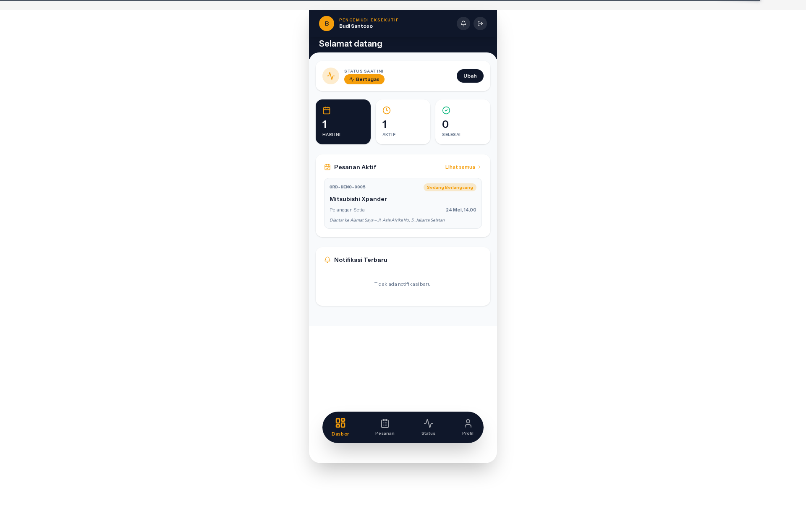

## UC-27 — Refund Payment (admin only)

### Refund — Paid tab list

- **Status**: ✅ PASS
- **URL/Menu**: `/admin/payments/verification?tab=paid`
- **Component**: Paid tab
- **Kondisi**: List pembayaran Paid yang bisa di-refund
- **Screenshot**:

  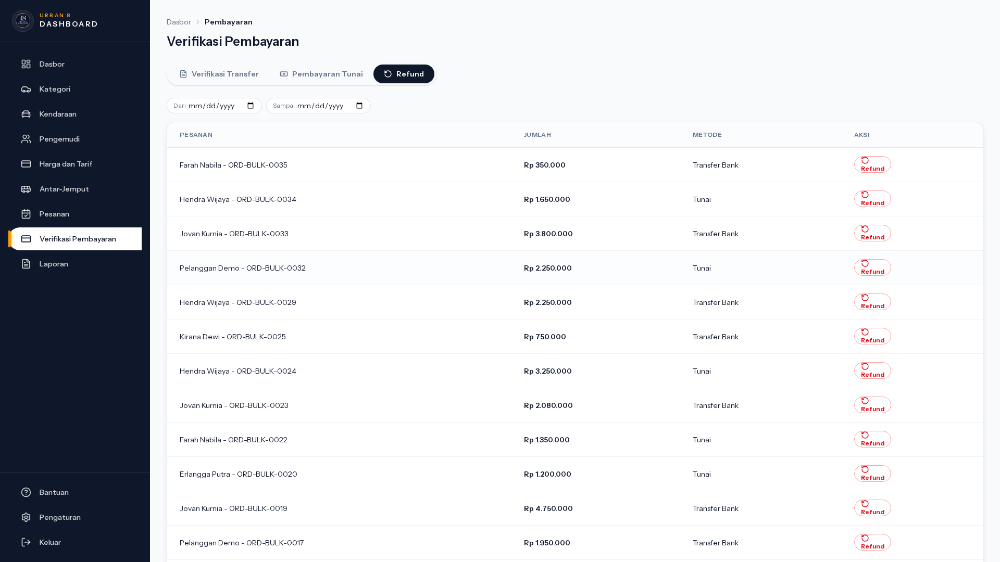

### Modal Refund Pembayaran

- **Status**: ✅ PASS
- **URL/Menu**: `/admin/payments/verification?tab=paid`
- **Component**: Refund dialog
- **Kondisi**: Trigger row "Refund"
- **Screenshot**:

  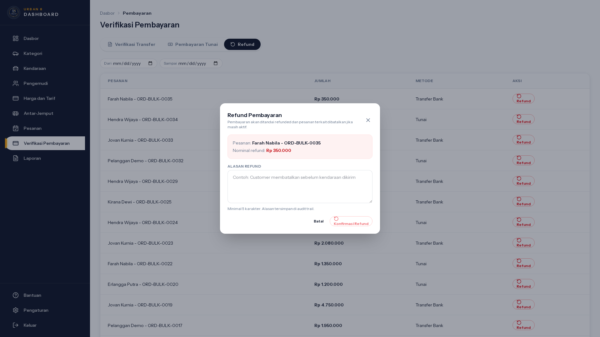

---

## Catatan untuk Manual Book

1. Setiap UC ada minimal 1 screenshot dengan kondisi entry-state (form kosong / list awal). Kalau perlu screenshot interaksi (form ter-fill, after-submit), tinggal extend script di `tests/qa/run-e2e-walkthrough.mjs`.
2. Audit log (UC-23) belum ada UI list explicit — sekarang via service `AuditLogger` saja. Roadmap: bikin `/admin/audit-logs` page untuk Admin.
3. Customer order detail pakai numeric `id`, bukan `order_number` yang kelihatan di UI. Kalau mau pakai `order_number` sebagai route binding, ubah di `routes/web.php` (`/orders/{order:order_number}`).
4. Re-run: `node tests/qa/run-e2e-walkthrough.mjs` (membutuhkan app running di `localhost:8080`).
5. Re-render report: `node tests/qa/render-report.mjs` (script ini).
